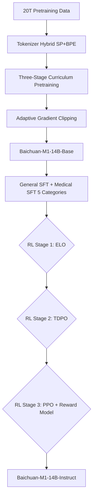

# Baichuan-M1：从零预训练的医疗大模型

## 一句话总结

Baichuan-M1 是一个 **从头开始、在 20T token 上预训练的医疗 LLM 系列**，通过 1T+ 权威医疗数据、100B+ 医疗合成推理数据、交替全局/滑动窗口 Attention、KV 短卷积、三阶段课程学习以及 ELO→TDPO→PPO 三阶段强化学习，在 14B 规模上实现了超过 Qwen2.5-72B-Instruct 的医疗能力，并接近 Claude-3.5-Sonnet / GPT-4o。

---

## 1. 论文解决的问题

### 1.1 问题定义

医疗领域需要专门的大语言模型：医学知识复杂（大量术语、罕见病、长病程、多模态决策依赖）、数据质量参差不齐、且对安全性和事实准确性要求极高。现有主流 LLM 多为通用模型，医疗能力依赖垂直领域的继续预训练或后训练。

### 1.2 为什么重要

- 医疗属于**高风险垂直场景**，误诊、幻觉、药物冲突可能直接危害患者。
- 通用模型对罕见病、长病程、中英文医学文献与临床指南的理解仍存在显著不足。
- 开源商用友好的医疗 SOTA 模型匮乏，限制了行业落地与学术研究。

### 1.3 现有方法的不足

作者指出两条常见路径的局限（page 18）：

1. **继续预训练（continue pretraining）**：在已经充分预训练好的通用 base 上继续加医疗数据，很难在不损害通用能力的前提下显著提升医疗垂直能力，尤其是 base 已经经历过 annealing 后。
2. **通用 base + 后训练 / SFT**：医疗知识不是“表层风格”，而是深层的术语体系、推理路径和事实网络，后训练难以弥补预训练阶段的数据亏空。

因此，本文主张**从零开始预训练一个既保持通用能力、又把医疗作为核心目标的模型**。

---

## 2. 核心贡献

### 2.1 贡献一：从零预训练的医疗 LLM 系列（14B 开源）

- **做了什么**：Baichuan-M1-14B / Base / Instruct 全链路开源；背后还有更大规模系列（论文未公开具体尺寸）。
- **新意**：不是把医疗能力当作增量任务堆到通用模型上，而是在预训练阶段就同时优化通用与医疗能力。
- **证据**：14B Instruct 在 20+ 医疗 benchmark 平均 72.23，超过 Qwen2.5-72B-Instruct 的 70.51（Table 3, page 17）。

### 2.2 贡献二：20T token 的通用+医疗课程数据配方

- **做了什么**：20T 预训练 token = 12T 英文 + 4T 中文 + 2T 多语言 + 2T 代码（Table 1, page 3）；外加 1T+ 权威医疗数据、100B+ 医疗合成推理 token。
- **新意**：提出“去重+按重复次数上采样”的 upsampling 策略、多维质量评分、以及面向医疗源（百科、病例、知识图谱、论文、在线 QA）的合成流水线。
- **证据**：3B/1T 消融显示“全局去重 + 按重复次数上采样”显著优于单纯全局去重（Figure 2, page 3）；高质量数据即使 10× 上采样也不掉点（Figure 3, page 3-5）。

### 2.3 贡献三：面向长上下文与推理效率的架构改造

- **做了什么**：Llama-like 预归一化 + RMSNorm + SwiGLU + RoPE 基础上，引入**交替全局 Attention / 滑动窗口 Attention**、**K/V 短卷积**、head dim 256 的全局头、RoPE base 1M、32k 上下文。
- **新意**：在 KV Cache 与长上下文检索之间做非对称设计——全局层只留 2 头负责长程依赖，滑动窗口层 8 头负责局部，降低推理内存。
- **证据**：1.5B/200B 消融（Table 2, page 10）显示，加入滑动窗口和卷积后 commonsense 平均仍保持 62.57，NIAH 从 88.4 提升到 89.4。

### 2.4 贡献四：ELO → TDPO → PPO 三阶段强化学习

- **做了什么**：先用 ELO（Exploratory Log-likelihood Optimization）在无外部 reward 的情况下探索 CoT；再用 TDPO 做 token 级偏好优化，解决 DPO 序列级 KL 惩罚对短答案不公平的问题；最后用 PPO + reward model 精修。
- **新意**：把“探索 → 偏好对齐 → reward model 精修”解耦成三个阶段，避免 reward hacking 并提升医疗长 CoT。
- **证据**：Figure 11（page 15）展示了三阶段 RL 流程；消融细节*论文未披露*。

### 2.5 贡献五：覆盖 20+ 医疗 benchmark 的系统评测

- **做了什么**：在 MCQ、临床分诊/诊断/治疗、罕见病推理、医学计算、医学语言理解等多维度评估，并公开了评估 prompt（Appendix D）。
- **证据**：Table 3/4（page 17-18）给出与 Qwen2.5-14B/72B-Instruct、Claude-3.5-Sonnet、GPT-4o 的完整对比。

---

## 3. 方法详解

### 3.1 数据配方

#### 3.1.1 通用预训练数据（20T）

| 语种/类型 | Token 量 | 备注 |
| -------- | ------- | ---- |
| 英文 | 12T | 主体 |
| 中文 | 4T |  |
| 多语言 | 2T | 混入 10% 最高质量 |
| 代码 | 2T | 只保留 top 20%，5× upsampling |
| **总计** | **20T** | Table 1, page 3 |

**关键策略**：

- **全局去重 + 按重复次数 upsampling**：记录每份文档在所有来源中的重复次数；用“自然分布”做受控上采样，最大 10 次。Figure 2（page 3）显示在 3B/1T 上比单纯全局去重更好。
- **多维质量评分**：Causal score、Educational score、Reasoning density、Knowledge density，由小模型评分；低质量数据在预训练阶段剔除。
- **代码质量过滤**：用 Qwen2.5-Coder 微调一个质量打分模型，保留 top 20% 并 5× upsampling，效果最好。
- **多语言策略**：10% 最高质量多语言数据混入可 slightly enhance 中英能力。
- **STEM 合成**：SOTA 模型生成，通用 reward model 筛选，仅用于 annealing 阶段。
- **数据拼接**：优化长序列拼接，减少不必要 truncation，提升长上下文理解。


> **Figure 2**: 全局去重 vs 去重+按重复次数上采样。3B/1T 消融显示后者在多个基准上的聚合得分显著更高。


> **Figure 3**: 数据质量与数据量的权衡。Baseline 仅剔除低质量数据；Top 33% 3× upsampling 与 Top 10% 10× upsampling 效果相当，说明高质量数据可以激进上采样。


> **Figure 4**: 代码数据质量筛选策略对比。仅保留 top 20% 并 5× upsampling 优于不过采样或 top 50% + 2× 策略。


> **Figure 5**: 多语言数据过滤与混入比例对比。混入 10% 最高质量多语言数据可轻微提升中英能力。

#### 3.1.2 医疗数据（1T+ 权威 + 100B+ 合成）

医疗数据来源覆盖 200+ 权威医学知识源：学术文献、真实病例、教科书、知识图谱、临床指南、百科、在线 QA 等（page 6）。

针对医疗数据，专门设计了：

- **Medical quality score**
- **Medical value score**

合成数据管道（Figure 6, page 7-8）分五类源：


> **Figure 6**: 医疗合成数据生成 pipeline，覆盖百科/教材/指南、真实病例、知识图谱、学术论文、在线客服 QA 五类来源。

1. **百科/教材/指南**：分块 → 知识量过滤 → 知识点抽取 → 生成题目（单选/简答）→ 无参考生成答案（强调长 CoT）→ 用参考修订答案。
2. **真实病例**：提取临床决策 → 提取正/反面证据 → 专家推理模拟（鉴别诊断、治疗方案）→ 整合并改写为完整推理。
3. **知识图谱**：Markdown 模板转自然语言；多格式生成；“实体作为答案”反向出题；相似实体做易混淆选项。
4. **学术论文**：抽取关键证据和结论 → 用 SOTA 模型生成分析桥梁。
5. **在线 QA**：模型先自答，再用原始答案修订，兼顾准确性与全面性。

*论文未披露*：医疗数据在三个预训练阶段中的精确比例、合成数据的最终筛选比例、医疗 value reward model 的架构与训练细节。

### 3.2 模型架构

框架继承 Llama-like pre-norm + RMSNorm + SwiGLU FFN + RoPE，关键改动：

| 模块 | 配置 | 动机 |
| ---- | ---- | ---- |
| Attention | 交替全局 / 滑动窗口 | 降低 KV Cache、兼顾长程检索 |
| 全局 Attention | 2 heads，head dim 256 | 早期实验发现 256 head dim 对 benchmark 涌现更友好 |
| 滑动窗口 Attention | 8 heads，head dim 128 | 负责局部上下文 |
| KV 短卷积 | 对 K、V 做时域短卷积 | 提升 in-context learning 能力 |
| RoPE base | 1,000,000 | 支撑 32k 长上下文；消融显示 base=1e4 短期 benchmark 不差但长距离检索能力下降 |
| 上下文长度 | 8K（阶段 1/2）→ 32K（阶段 3） | 课程式扩展 |
| 词表 | 133,120 | 合并通用 SentencePiece + 多语言/医疗 HuggingFace BPE |

**消融证据（Table 2, 1.5B/200B）**：

| 变体 | commonsense avg | NIAH |
| ---- | -------------- | ---- |
| Baichuan 配置 | 62.57 | 89.4 |
| w/o sliding window | 60.93 | 93.3 |
| w/o conv | 59.73 | 88.4 |
| base=1e4 | 62.02 | 91.2 |
| 75% sliding window | 62.57 | 89.4 |

*推断*：滑动窗口对短期 benchmark 有轻微增益，但长程检索能力下降；卷积对 benchmark 贡献最显著。

**KV Cache 效率**：Baichuan-M1-14B 的 KV Cache 介于 GQA 6 头（短上下文）到 GQA 4 头（长上下文）之间，见图 7。


> **Figure 7**: Baichuan-M1-14B 与其他模型在不同上下文长度下的 KV Cache 对比。短上下文约等于 GQA 6 头，长上下文约等于 GQA 4 头。

*论文未披露*：滑动窗口大小在 14B 上的具体取值、全局/滑动窗口层的具体排布模式、隐藏层维度/层数等完整配置表。

### 3.3 训练流程

#### 3.3.1 Tokenizer

- 合并 SentencePiece（通用基础）+ HuggingFace BPE（多语言/医疗）。
- 规则（Appendix C, page 30）：
  - 不做 normalization（`normalization_rule_name = identity`）
  - 保留纯 whitespace token，提升代码编码效率
  - 数字拆成单个 digit
  - 字符覆盖率 0.9999，罕见字回退到 UTF-8 bytes


> **Figure 9**: 不同模型在多种语言上的 tokenization efficiency 对比（越低越好）。混合域 tokenizer 在医疗/多语言文本上更高效。

*论文未披露*：词表合并的具体冲突处理规则、tokenizer 训练语料规模、Figure 12 的具体数值。

#### 3.3.2 三阶段课程预训练（Baichuan-M1-14B）

| 阶段 | Token | 数据特点 | 上下文 | LR |
| ---- | ----- | -------- | ------ | --- |
| 阶段 1 | 12T | 通用/简单数据，医疗比例低 | 8K | peak 4e-4 |
| 阶段 2 | 6T | 质量更高、更专业医疗数据 | 8K | warm-up-stable-decay |
| 阶段 3（Annealing） | 2T | 复杂应用数据、长上下文 | 32K | cosine annealing to 2e-5 |

其他超参数：AdamW β1=0.9, β2=0.95；weight decay 0.1；gradient clipping 1.0；warmup 2000 步；batch size 16M token（推断，论文写 16M 未明确单位，结合上下文应为 tokens）。

RoPE base 先 1e5，后提升到 1e6（推断为阶段 3）。

#### 3.3.3 Adaptive Gradient Clipping（AGC）

训练早期稳定技巧（Algorithm 1, page 11-12）：维护最近 100 步梯度范数栈 S，若当前范数 > 1.2 × avg(S) + 0.1 且 skip_counter < 1，则跳过该步；否则正常更新并记录范数。


> **Figure 10**: AGC 对训练早期 loss 稳定性的改善。使用 AGC 后，初始阶段 loss 震荡明显减小。

### 3.4 对齐（Alignment）

#### 3.4.1 SFT 数据

- **通用 SFT**：内部数据多轮迭代 + 数学/代码竞赛类任务。
- **医疗 SFT 五类**（page 13）：
  - 医学知识
  - 医学语言理解
  - 医学推理
  - 医学长上下文
  - 医学安全

**医学安全**：建立安全分类体系 + 覆盖标签 + 对抗攻击策略 + 2-3 个 case per 攻击向量 + prompt engineering/few-shot 生成 + prefix/suffix 变体去重 + 语义去重。

**SFT 超参数**：基于 Baichuan-M1-14B-Base 五轮微调；格式为 system prompt + problem + response；cosine decay LR 从 2e-5 开始；“sample masking”打包多个样本防止交叉污染。

*论文未披露*：SFT 数据样本总数、batch size、总步数、上下文长度。

#### 3.4.2 Reward Models

- **Rule-based RM**：适合可验证答案（教材/病史中的医学诊断、代码编译器反馈等）。
- **Model-based RM**：针对不确定答案，从 Baichuan-M1 checkpoint 在精心构造的偏好数据集上训练，引入专家先验减少 reward hacking。

*论文未披露*：model-based RM 的模型尺寸、训练数据量、loss 函数。

#### 3.4.3 三阶段强化学习（ELO → TDPO → PPO）

**Figure 11** 展示了整体流程。

**ELO（Exploratory Log-likelihood Optimization）**

直觉：不依赖外部 reward model，直接优化模型生成连贯 CoT 路径后给出正确答案的 log-likelihood，避免 reward hacking 并鼓励探索式推理。

目标函数：

$$
\mathcal{L}_{ELO} = -\mathbb{E}_{Q} \log \pi_M(A|Q) = -\mathbb{E}_{Q} \log \mathbb{E}_{CoT \sim M} \pi_M(A|Q, CoT)
$$

通过 Jensen 不等式得上界：

$$
\mathcal{L}_{ELO} \le \mathcal{L}_{upper} = -\mathbb{E}_{Q} \mathbb{E}_{CoT \sim M} \log \pi_M(A|Q, CoT)
$$

梯度：

$$
\nabla \mathcal{L}_{upper} = -\mathbb{E}_{Q} \mathbb{E}_{CoT \sim M} \big( \log \pi_M(A|Q, CoT) - b(Q, A) \big) \nabla \log \pi_M(CoT|Q)
$$

符号说明：

| 符号 | 含义 |
| --- | ---- |
| Q | 用户 query/问题 |
| A | 标准答案 |
| CoT | 模型生成的 chain-of-thought |
| π_M | 模型策略 |
| b(Q, A) | 基线函数，用于降低方差 |

*论文未披露*：b(Q, A) 的具体形式与取值、ELO 训练数据与超参数。

**TDPO（Token-level DPO）**

解决传统 DPO 序列级 KL 惩罚对短回答不公平的问题，转而在 token 级别做偏好优化。

*论文未披露*：TDPO 损失函数完整形式、β 等超参数。

**PPO**

基于前两阶段的能力，引入 reward model 做最终精修。

---

## 4. 架构 / 流程图


> **Figure 1**: Baichuan-M1-14B 与其他模型的医疗能力对比。核心结论是在 14B 规模上追平了更大尺寸的 Qwen2.5-72B-Instruct，并接近 Claude-3.5-Sonnet / GPT-4o。


> **Figure 8**: Baichuan-M1-14B 的 Attention 机制：交替全局注意力（2 heads，head dim 256）与滑动窗口注意力（8 heads，head dim 128），并对 K/V 做短卷积。该设计旨在降低长上下文推理时的 KV Cache，同时保留长程检索能力。


> **Figure 11**: 三阶段强化学习流程：ELO（Exploratory Log-likelihood Optimization）在无外部 reward model 的情况下鼓励 CoT 探索；TDPO 做 token 级偏好优化，缓解 DPO 对短答案的惩罚；最后 PPO 用 reward model 精修。



---

## 5. 实验结果

### 5.1 实验设置

| 项目 | 内容 |
| ---- | ---- |
| 模型 | Baichuan-M1-14B（开源 Base + Instruct） |
| 预训练 | 20T token，三阶段课程 |
| 上下文 | 8K / 32K |
| 对比基线 | Qwen2.5-14B-Instruct、Qwen2.5-72B-Instruct、Claude-3.5-Sonnet、GPT-4o |
| 医疗 benchmark | 20+，含 MedCalc、Multiple-Choice、ClinicalBench、MedNLI、NEJMQA、RareArena、RareBench、CMBClin、MMLU-genetics 等 |
| 评估方式 | 多数用 LLM-as-judge，Appendix D 公开 prompt；MCQ 类直接判 option |
| 代码/数学 | MBPP、MBPP+、HumanEval、HumanEval+、BigCodeBench、MATH、CMATH |

### 5.2 主实验结果

**医疗能力平均（Table 3, page 17）**

| 模型 | 医疗 benchmark 平均 |
| ---- | ------------------- |
| Baichuan-M1-14B-Instruct | **72.23** |
| Qwen2.5-14B-Instruct | 65.39 |
| Qwen2.5-72B-Instruct | 70.51 |
| Claude-3.5-Sonnet | 74.85 |
| GPT-4o | 75.00 |

部分分项（page 17）：

| Benchmark | Baichuan-M1-14B | Qwen2.5-72B | Claude-3.5-Sonnet | GPT-4o |
| --------- | --------------- | ------------ | ----------------- | ------ |
| RareArena-rdc | 81.80 | 76.20 | 89.60 | 88.40 |
| RareArena-rds | 54.00 | 49.80 | 59.80 | 57.20 |
| NEJMQA | 49.75 | 50.76 | 69.54 | 54.31 |
| MediQ | 83.40 | 79.90 | 88.80 | 90.20 |
| MMLU-genetics | 91.00 | 87.00 | 97.00 | 95.00 |

**结论**：14B 规模医疗平均超过 72B 开源对手，与 Claude/GPT-4o 差距缩小到 2-3 个点。

### 5.3 通用能力保留（Base 模型）

| Benchmark | Baichuan-M1-14B-Base | Qwen2.5-14B | Qwen2.5-72B |
| --------- | -------------------- | ----------- | ----------- |
| MBPP | 74.0 | 72.8 | 86.5 |
| MBPP+ | 63.0 | 63.2 | 70.1 |
| HumanEval | 60.4 | 56.7 | 59.1 |
| MATH | 46.0 | 45.4 | 48.2 |
| CMATH | 88.3 | 88.7 | 86.8 |

结论：尽管为医疗预训练，14B Base 的代码/数学能力没有塌陷，与 Qwen2.5-14B 同档，但不及 72B。

### 5.4 消融实验

| 实验 | 关键发现 | 位置 |
| ---- | ------- | ---- |
| 去重+上采样 | 比单纯全局去重显著更好 | Figure 2, page 3 |
| 高质量数据 10× upsampling | 与 top 33% 3× upsampling 相当，说明激进上采样安全 | Figure 3, page 3-5 |
| 代码 top 20% + 5× | 优于不过采样或 top 50% + 2× | Figure 4, page 4-5 |
| 多语言 10% 混入 | slightly enhance 中英 | Figure 5, page 4-5 |
| Attention/卷积/RoPE | 卷积贡献最大；滑动窗口影响轻微；RoPE base=1M 对长距离 NIAH 更优 | Table 2, page 10 |

---

## 6. 工程视角分析

### 6.1 实现难度

高。需要：

- 20T token 清洗与质量评分基础设施
- 1T+ 医疗数据授权、专家标注、合成 pipeline
- 数千 GPU 级别的预训练集群
- 32k 上下文 + 交替 Attention 的实现与收敛调试
- 三阶段 RL 的数据与 reward model 工程

### 6.2 性能瓶颈

- **数据 I/O 与清洗**：20T 跨语言去重、质量评分、上采样策略是工程大头。
- **长上下文**：32k annealing 阶段对内存和通信压力显著。
- **KV Cache 内存**：交替滑动窗口 + 全局本质上是在 GQA 之外的另一种“结构性压缩”，但全局头 head dim 256 会略微增加每头 KV 量。
- **RL 训练稳定性**：ELO + TDPO + PPO 三段切换增加了 pipeline 复杂度。

### 6.3 资源消耗

*论文未披露*：GPU 数量、训练时间、能耗、成本。

### 6.4 工程权衡

- **从零训练 vs 继续预训练**：作者用初步实验认为从零训练对垂直能力更优，但这意味着巨大的计算和数据工程投入。
- **全局 Attention 头数少但 dim 大**：用更少头但更高 dim 保留长程能力，换取 KV Cache 降低。
- ** sliding window + 短卷积**：用卷积增强局部聚合，避免滑动窗口损失 in-context learning。
- **Rule-based RM + Model-based RM**：在医疗可验证问题上用规则保证可靠性，不确定问题上用模型保证泛化。

### 6.5 生产落地风险

- **幻觉与责任**：医疗场景对错误敏感，当前 LLM-as-judge 评测仍可能高估真实临床准确率。
- **罕见病、NEJMQA、真实病例**：这些 benchmark 上仍明显落后顶级闭源模型。
- **评测可复现性**：部分开放题采用 LLM-as-judge，prompt 设计的轻微变化可能影响排名。
- **监管与临床准入**：模型能力不等于医疗器械合规，不能直接用于诊疗决策。

---

## 7. LLM / Infra 专项分析

### 7.1 对训练的影响

- **计算量**：20T token × 14B 模型 ≈ 巨大；作者未披露具体 FLOPs。
- **显存**：32k 上下文 annealing 对激活值显存压力高，需结合 gradient checkpointing 与序列并行。
- **通信**：batch size 16M token _GLOBAL_ 需要较高数据并行度，通信量不可忽略。
- **并行策略**：*论文未披露*，但 14B 模型通常采用 TP/PP/DP 组合，32k 上下文下 likely 需要 SP 或 CP。
- **Checkpoint / Recomputation**：长上下文阶段必然启用 activation checkpointing。

### 7.2 对推理的影响

- **Prefill**：交替滑动窗口 + 全局注意力对 prefill attention 计算量影响较小（滑动窗口计算量更低）。
- **Decode**：KV Cache 介于 GQA 6 头（短上下文）到 GQA 4 头（长上下文）之间，显著降低长序列 decode 内存。
- **KV Cache 组织**：因 global/sliding window 交替，KV 缓存需按层区分有效窗口，可能增加推理框架的调度复杂度。
- **Batch Scheduling**：32k 上下文下 batch size 受内存限制显著。
- **Latency / Throughput**：滑动窗口层 decode 更快，全局层保持长程依赖。

### 7.3 对 CUDA / Kernel 的影响

- **Attention Kernel**：需要支持全局 + 滑动窗口混合 mask 的 FlashAttention 变体；相邻层 mask 模式不同，可能增加 kernel dispatch 开销。
- **KV 卷积**：对 K、V 序列做时域短卷积，需要 fuse 到 attention 前向中或单独 kernel；带宽 bound 风险。
- **RoPE base 1M**：不会影响 kernel 实现，但对长序列位置编码数值稳定性有要求。
- **Tokenizer Decode**：133k 词表在 embedding/head 层带来轻微内存增加，可忽略。

### 7.4 Trace / Profiling 关注点

如要复现或部署，可关注：

- **Nsight Systems / PyTorch Profiler**：查看混合 attention 的 kernel launch overhead、KV 卷积的带宽占用。
- **长上下文 Prefill**：Nsight Compute 中查看 HBM bandwidth 与 Tensor Core 利用率。
- **Decode 阶段内存**：监控 sliding window 层 KV Cache 实际占用是否符合预期。
- **Loss 曲线**：AGC 对早期 loss spike 的抑制效果。

---

## 8. 局限性与问题

### 8.1 作者明确提到的局限

- 14B Instruct 仍落后于 Claude-3.5-Sonnet 和 GPT-4o（Table 3）。
- 罕见病诊断、真实临床咨询仍有提升空间（page 18）。
- 继续预训练通用 base 来提升垂直能力会牺牲通用能力（作者初步实验观察）。

### 8.2 深层局限分析

- **消融规模不足**：Table 2 使用 1.5B/200B 小模型，14B 上的最优配置未必直接迁移。
- **RL 三阶段缺少独立消融**：ELO/TDPO/PPO 各自的贡献、超参数敏感性均未披露。
- **医疗数据权威性**：1T+ 医疗数据来源多，但清洗后仍可能包含过时或冲突医学知识。
- **评测偏差**：LLM-as-judge 对主观题（如治疗计划）评分可能受提示和 judge 模型能力影响。
- **可复现性**：训练代码、完整超参数表、硬件、训练时长、总成本均未披露。

### 8.3 未来改进方向

- 引入多模态（影像、检验单、病历扫描件）能力。
- 更大模型规模与更长上下文扩展。
- 面向真实临床工作流的 agent 化与工具调用。
- 医学知识随时间更新机制。
- 更严格的安全评估与红队测试。

---

## 9. 复现指南

### 9.1 复现所需资源

- **Code**: https://github.com/baichuan-inc/Baichuan-M1-14B
- **Checkpoint**: https://hf.co/baichuan-inc/Baichuan-M1-14B-Base, https://hf.co/baichuan-inc/Baichuan-M1-14B-Instruct
- **Dataset**: *论文未披露完整训练数据*，仅能从公开医疗数据集（PMC-Patient、MIMIC 等）重建一部分。
- **Hardware**: *论文未披露*，估计 14B × 20T 需要数千 GPU × 数周。
- **Training config**: 部分公开（LR、batch size、三阶段 token 数），但完整细节缺失。
- **Evaluation prompts**: Appendix D / Table 5-6 已公开，可复现评分流程。

### 9.2 论文缺失信息

| 参数类别 | 缺失信息 | 影响 |
| ---- | ---- | ---- |
| 模型完整配置 | 隐藏层维度、层数、FFN 维度、滑动窗口大小 | 无法从头精确复现架构 |
| 硬件 | GPU 数量、型号、训练时间 | 无法估算成本与效率 |
| SFT 数据 | 样本数、超参数、训练步数 | 复现 Instruct 模型困难 |
| Reward model | 模型尺寸、训练数据、loss | 无法复现 PPO 阶段 |
| ELO/TDPO | 完整 loss、β、b(Q,A)、训练数据 | 无法精确复现 RL 阶段 |
| 医疗数据比例 | 三阶段中医疗/通用数据精确配比 | 难以复制课程学习 |
| 评测 judge | Table 6 使用的 LLM judge 模型 | 评测结果可复现但不稳定 |

### 9.3 复现难度评分

**评分：4/5**

原因：开源了 14B Base + Instruct 权重和 GitHub 仓库，权重可直接用于推理与微调；但完整训练数据、训练代码、全部超参数、硬件配置均未披露，从头预训练几乎不可能；评测 prompt 已公开，部分 benchmark 结果可复现。

---

## 10. 与已有工作的关系

### 10.1 技术演进链

```text
通用预训练 LLM (Llama, Qwen2.5)
  ↓
医疗继续预训练 / SFT (Med-PaLM, HuatuoGPT 等)
  ↓
通用模型 + 医疗 Agent & RLHF
  ↓
Baichuan-M1: 从零预训练 + 医疗数据课程 + 三阶段 RL
```

### 10.2 相关工作对比

| 工作 | 核心思想 | 与本文关系 |
| ---- | ------- | ------- |
| Med-PaLM / Med-PaLM 2 | PaLM 继续预训练 + 医疗 SFT / 提示 | 最早展示医疗 LLM 潜力的工作，本文受启发但选择从头训练 |
| HuatuoGPT 系列 | 中文医疗 LLM，基于通用 base + 医疗数据 SFT/RLHF | 国内医疗 LLM 代表，本文在预训练阶段即深度整合医疗 |
| Qwen2.5 | 通用预训练模型，开源多种尺寸 | 本文主要对比基线 |
| DeepSeek-R1 / 推理模型 | 强化学习增强长 CoT 推理 | 本文 ELO 阶段借鉴了无 reward model 探索推理的思路 |
| DPO / TDPO | 偏好优化 | 本文使用 TDPO 做 token 级偏好优化 |

### 10.3 可链接的已有笔记

- [[LLM Pretraining Curriculum]]
- [[Medical LLM Survey]]
- [[Attention Mechanism Sliding Window]]
- [[RLHF PPO DPO]]

---

## 11. 知识图谱

```text
医疗大模型
├── 数据
│   ├── 通用预训练数据 (20T)
│   ├── 权威医疗数据 (1T+)
│   └── 医疗合成数据 (100B+)
├── 模型架构
│   ├── Llama-like
│   ├── 交替 Global / Sliding Window Attention
│   ├── K/V 短卷积
│   └── RoPE base=1M
├── 训练
│   ├── 三阶段课程学习
│   ├── AGC 梯度裁剪
│   └── Hybrid Tokenizer
├── 对齐
│   ├── 医疗 SFT 五类
│   ├── Rule-based RM
│   ├── Model-based RM
│   └── ELO → TDPO → PPO
└── 评测
    ├── 20+ 医疗 benchmark
    ├── LLM-as-judge
    └── 通用代码/数学保持
```

---

## 12. 个人思考

### 12.1 最核心的洞察

医疗这种**高知识密度、高事实准确性、高风险**的垂直领域，不能指望在通用 base 上做“最后一英里”微调补齐。预训练阶段就注入医疗数据，并配合课程学习与长上下文，才能形成真正的领域能力。这是一个“数据+训练阶段”共同决定上限的案例。

### 12.2 最值得记住的数字

- **20T** 预训练 token
- **1T+** 权威医疗数据
- **100B+** 医疗合成推理 token
- **72.23** vs 70.51：14B 医疗平均超过 Qwen2.5-72B-Instruct
- **133,120** 词表（SentencePiece + BPE 合并）
- **4e-4** peak LR，**16M** batch size

### 12.3 最值得学习的设计选择

1. **从零预训练而非继续预训练**：敢于投入巨额算力做垂直模型，换来能力上限提升。
2. **交替 global / sliding window + 短卷积**：用结构性设计替代纯 GQA，灵活平衡长程与内存。
3. **ELO → TDPO → PPO**：把“探索、对齐、精修”解耦，降低 reward hacking。
4. **医疗 SFT 五分类法**：知识、语言理解、推理、长上下文、安全，直面医疗场景的完整需求。

### 12.4 我会如何复现 / 验证

- 步骤 1：用开源 Base 在公开医疗 benchmark 上复现 Table 3 的 prompt 与评分。
- 步骤 2：用 medical SFT 数据做 LoRA/全参微调，验证 Instruct 提升是否主要来自 SFT/RL。
- 步骤 3：分析 Base 模型在 MMLU-medical 子集上的表现，验证“预训练阶段医疗能力”是否显著。
- 步骤 4：提取 K/V 卷积和 Attention mask 逻辑，测量长上下文下的 KV Cache 与 throughput。

### 12.5 我会继续追的问题

- Baichuan-M1 系列是否包含 7B 以下或 70B+ 版本？
- 医疗合成数据 100B+ 中，各来源比例和最终筛选率是多少？
- 三阶段 RL 中 ELO/TDPO/PPO 各自的独立贡献 Ablation。
- 真实临床场景（门诊病历理解、检验单解读）下的表现如何？

---

## 13. 面试问题

### Junior

1. 为什么 Baichuan-M1 选择从零预训练而不是继续预训练通用模型？
2. 20T token 的构成是什么？医疗数据占多少？
3. 交替 global 和 sliding window attention 的目的是什么？
4. AGC 的基本原则是什么？解决什么问题？
5. 论文开源了哪些产物？

### Senior

1. 请推导 ELO 上界中 Jensen 不等式的应用，并解释为什么能避免 reward model 偏差。
2. TDPO 与传统 DPO 的关键区别是什么？为什么 token 级 KL 更公平？
3. 从 KV Cache 角度分析，全局 2 heads dim256 + 滑动窗口 8 heads dim128 与 GQA 相比的优劣。
4. 如何设计一个医疗合成数据 pipeline 来保证事实准确性和多样性？
5. 如果要在保留通用代码/数学能力的同时继续提升医疗能力，你会调整哪些训练策略？

### Staff / Principal

1. 假设你负责把 Baichuan-M1 部署到三甲医院辅助诊疗系统，你会如何设计安全护栏、幻觉检测和责任边界？
2. 论文的 20T 训练数据+三阶段课程学习，如何在工程上验证每个阶段对最终医疗能力的边际贡献？
3. 交替 attention + KV 短卷积对训练稳定性和推理吞吐量的 trade-off 是什么？如何量化？
4. 在医疗 LLM 评测中，LLM-as-judge 的偏差如何控制？你会设计怎样的交叉验证机制？
5. 如果要将模型扩展到多模态（影像+病历文本），预训练和对齐策略会如何变化？

---

## 14. 关键引用

```bibtex
@article{baichuan2025m1,
  title={Baichuan-M1: Pushing the Medical Capability of Large Language Models},
  author={Baichuan Inc.},
  journal={arXiv preprint arXiv:2502.12671},
  year={2025},
  url={https://arxiv.org/abs/2502.12671v2}
}
```

---

## 附录 A：论文未披露的关键信息

| 参数类别 | 缺失信息 | 说明 |
| ---- | ---- | ---- |
| 模型完整尺寸表 | 14B 的层数、隐藏维度、FFN 维度、滑动窗口大小 | 无法精确复现架构 |
| 硬件与训练时长 | GPU 数量/型号、总训练时间、能耗 | 无法估算成本与效率 |
| 三阶段数据配比 | 各阶段医疗数据与通用数据比例 | 课程学习细节缺失 |
| SFT 训练超参数 | batch size、步数、数据量 | 无法复现 Instruct |
| Reward model | 模型尺寸、训练数据、loss | PPO 阶段不完整 |
| ELO/TDPO 细节 | b(Q,A) 形式、TDPO 损失、β | RL 阶段不完整 |
| 评测 judge 模型 | Table 6 使用哪个 LLM 做 judge | 可复现但不稳定 |
| 完整训练代码 | 未开源数据 pipeline 和训练脚本 | 只能基于权重微调 |

---

## 附录 B：分块阅读覆盖记录

| Chunk | Page Range | Subagent Output | Covered |
| ----- | ---------- | --------------- | ------- |
| chunk_001/002 | 1-12 | agent_outputs/chunk_001_002.md | yes |
| chunk_003/004 | 13-24 | agent_outputs/chunk_003_004.md | yes |
| chunk_005/006 | 25-33 | agent_outputs/chunk_005_006.md | yes |

Long PDF Mode：是（33 页 > 30 页阈值）
Figure 来源：arXiv HTML 原图（P0 来源）
保留 PDF 渲染页：page 3, 10, 17, 18, 30（用于 Table / 附录文本）

---

## 插入的论文图片索引

### Figure 原图（来自 arXiv HTML）

- `baichuan_m1_fig1_medcap.png` — Figure 1：医疗能力总览
- `baichuan_m1_fig2_dedup.png` — Figure 2：去重 + upsampling 策略
- `baichuan_m1_fig3_repetition.png` — Figure 3：数据质量 vs 数据量
- `baichuan_m1_fig4_code.png` — Figure 4：代码数据策略
- `baichuan_m1_fig5_multilingual.png` — Figure 5：多语言数据策略
- `baichuan_m1_fig6_pipeline.png` — Figure 6：医疗合成数据 pipeline
- `baichuan_m1_fig7_kvcache.png` — Figure 7：KV Cache 效率
- `baichuan_m1_fig8_attention.png` — Figure 8：Attention 架构
- `baichuan_m1_fig9_tokenizer.png` — Figure 9：Tokenizer 效率
- `baichuan_m1_fig10_agc.png` — Figure 10：AGC 训练稳定性
- `baichuan_m1_fig11_rl.png` — Figure 11：三阶段 RL

### Table / 附录页（来自 PDF 整页渲染）

- `baichuan_m1_page3.png` — Table 1（数据构成）+ Figure 2/3 原始位置
- `baichuan_m1_page10.png` — Table 2，架构消融
- `baichuan_m1_page17.png` — Table 3，主医疗结果
- `baichuan_m1_page18.png` — Table 4，通用能力保留
- `baichuan_m1_page30.png` — Appendix C tokenizer 规则 + Figure 12
