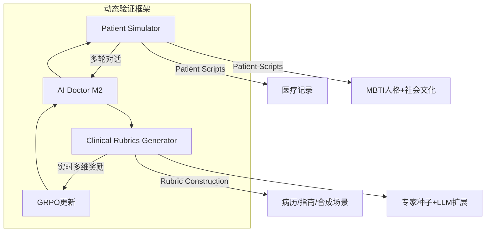
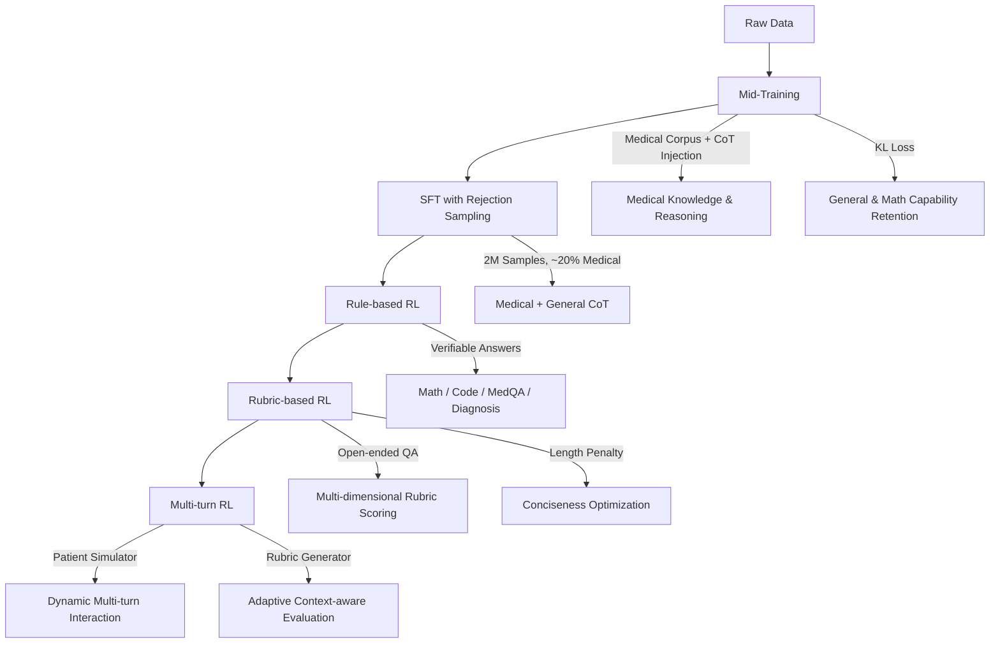
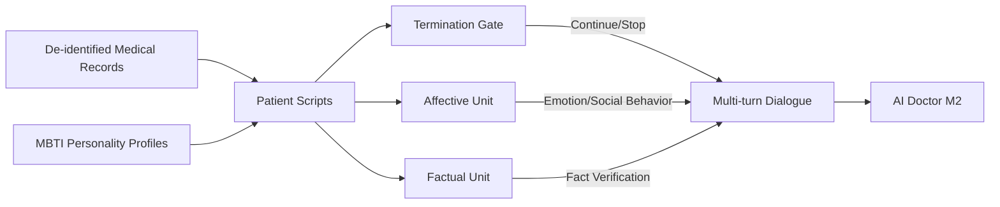
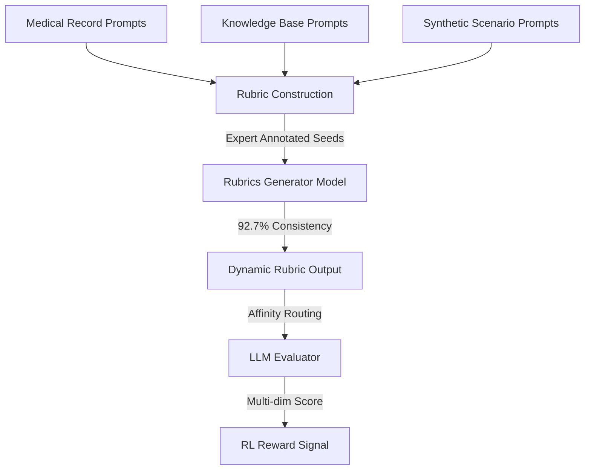

# Baichuan-M2: Scaling Medical Capability with Large Verifier System

## 一句话总结

本文构建了一套面向真实临床的大规模动态交互验证系统（Patient Simulator + Clinical Rubrics Generator），基于 Qwen2.5-32B-Base 训练出 32B 医疗增强推理模型 Baichuan-M2，通过 Mid-Training → SFT → 三阶段 RL（Rule-based → Rubric-based → Multi-turn）的递进对齐，在 HealthBench 上超越所有开源模型，Hard 子集成为全球第二个超过 32 分的系统（仅次于 GPT-5）；同时通过 W4A8 + FP8 KV Cache + Eagle-3 投机解码，实现单卡 RTX 4090 可部署的医疗 AI。

---

## 1. 论文解决的问题

### 1.1 问题定义

如何弥合医疗 LLM 在**静态考试基准**（如 USMLE）与**真实世界临床决策**之间的鸿沟。真实临床是部分可观测、多轮、信息不完整、需要动态判断与沟通伦理权衡的过程，而传统 benchmark 是单轮、信息完备、答案确定的任务。

### 1.2 为什么重要

- **静态 ≠ 动态**：真实诊疗需要边问诊、边收集信息、边做鉴别诊断， static QA 无法评估这些能力。
- **RLVR 的关键是评估系统**：数学/代码领域 RLVR 能持续突破，核心在于有精确可靠的 verifier。医疗长期缺少等价的动态 verifier，导致“考试分数高、临床决策弱”。
- **可部署性**：医院内网、隐私保护、成本约束要求模型不能停留在 API-only 或千亿参数规模。
- **安全与伦理**：医疗 AI 错误代价极高，需要同时评估诊断准确性、问诊逻辑、治疗合理性、沟通共情与伦理安全。

### 1.3 现有方法的不足

| 现有方法 | 不足 |
|---------|------|
| 静态 QA verifier（USMLE style） | 无法衡量多轮问诊、信息收集、动态推理、沟通共情等临床核心能力 |
| 简单医疗 SFT/RLHF | 奖励信号粗糙，无法对齐复杂临床推理与开放式回答 |
| 通用推理模型 + 医疗 prompt | 缺乏医疗领域深度内化，无真实交互训练 |
| 千亿参数闭源 API | 无法私有化部署，难以在真实医院环境落地 |
| 现有 Patient Simulator | 缺乏心理社会背景建模，易出现信息泄露、事实不一致、终止控制失败 |

---

## 2. 核心贡献

论文原文将贡献概括为三点：

1. **面向临床场景的动态 verifier 系统**：Patient Simulator 构造高保真决策环境，Clinical Rubrics 实时生成量化评估指标。
2. **多阶段 RL + 改进 GRPO**：在动态交互环境中训练，并对 GRPO 做针对性改进，使模型深度对齐专家临床推理。
3. **开源 SOTA 医疗模型**：以远低于竞品的参数规模达到顶级性能，刷新医疗 AI 性能-参数 Pareto 前沿。

### 2.1 动态验证框架

- **做了什么**：大规模高保真交互式 RL verifier 系统，含 Patient Simulator 与 Clinical Rubrics Generator。
- **为什么重要**：医疗领域首次实现大规模端到端交互式 RL 闭环。
- **证据**：Patient Simulator Privacy/Fact/Personification 分别为 98.3/96.1/89.2；Rubrics Generator 与专家标注一致性 92.7%。

### 2.2 三阶段递进式 RL 训练

- Rule-based RL → Rubric-based RL → Multi-turn RL。
- 改进了 GRPO：去除 KL、非对称裁剪、长度归一化、简化 advantage 归一化。
- 证据：AIME 稳定，HealthBench Hard 达到 34.7。

### 2.3 极致推理优化实现消费级部署

- W4A16/W4A8 量化 + FP8 KV Cache + Eagle-3 投机解码。
- 证据：单卡 RTX 4090 W4A8-KV8 下最大序列长度 21,133 tokens；投机解码吞吐 41.5 → 89.9 tokens/s（2.17×）。

### 2.4 开源 SOTA 医疗模型

- 基于 Qwen2.5-32B-Base，开源权重与代码。
- HealthBench Overall/Hard/Consensus 分别为 60.1/34.7/91.5，开源 SOTA。

---

## 3. 方法详解

### 3.1 验证系统（Verifier System）

**直觉解释**：传统验证是“开卷考试”，真实临床是“侦探小说”。Verifier System 把训练环境从静态 QA 升级为持续交互的“虚拟临床世界”。



#### 3.1.1 Patient Simulator（患者模拟器）

**Patient Scripts**：将医疗信息与心理社会信息融合。

| 信息维度 | 内容 | 示例 |
|---------|------|------|
| Medical Information | 主诉、现病史、既往史等 | 真实临床数据，覆盖多专科、多人群 |
| Psychological & Social | MBTI 16 型人格 + 社会文化背景 | E 型主动询问治疗；I 型被动接受；F 型对沟通敏感；经济受限者抗拒高价方案；高学历者偏好循证医学 |

> 论文参考 MBTI 16 人格模型 [20]，将人格特征映射为可观察行为。

**三模块架构**：

| 模块 | 功能 | 实现要点 |
|------|------|---------|
| Termination Gate | 判定对话是否应结束 | non-thinking model 快速决策 |
| Affective Unit | 生成符合人格画像的回复 | LLM + 合成数据训练，覆盖广泛人格与社会文化背景 |
| Factual Unit | 实时验证与患者记录是否一致 | LLM，防止信息泄露与事实捏造 |

> 论文 Figure 2 说明：Affective Unit 与 Factual Unit 均通过 LLM 实现，并采用 non-thinking model 快速判定终止条件与事实信息。

**多样性与一致性的平衡**：纯大模型人格保真高但成本 prohibitive；纯小模型行为一致性差。Baichuan-M2 通过三模块分工，用小模型达到接近大模型的效果。

**评估指标**：

- **单轮层面**：Privacy Score（不泄露非必要隐私的比例）、Fact Score（与记录一致的比例）。
- **会话层面**：Personification Score（人格一致性与社会文化一致性的等权综合）。

| 指标 | Baichuan-M2 | 说明 |
|------|-------------|------|
| Privacy Score | 98.3 | 优于 DeepSeek-V3 prompt-based 基线 |
| Fact Score | 96.1 | 优于 DeepSeek-V3 prompt-based 基线 |
| Personification Score | 89.2 | 人格与社会文化一致性高 |

> *论文披露*：DeepSeek-V3 加入心理信息后 Privacy/Fact Score 显著下降，说明简单 prompt 方式会引入过多随机噪声；Baichuan-M2 三模块设计在提升人格化分数同时保持高稳定性。

#### 3.1.2 Clinical Rubrics Generator

**三大属性**：

| 属性 | 说明 |
|------|------|
| Comprehensiveness | 多维度评估，不止答案对错 |
| Reliability | 标准经临床医生验证 |
| Adaptiveness | 根据患者特征动态调整 |

**Prompt 来源**：

1. 真实病历驱动
2. 知识库驱动（教材、指南、药典）
3. 合成场景驱动（住院病历书写、体检报告解读、智能分诊等）

**Rubric 构建流程**：

1. 医学专家定义核心评估维度。
2. LLM 生成候选 rubrics。
3. 专家筛选、定制。
4. 专家为每条 rubric 赋予 [-10, 10] 整数权重。
5. 以加权 rubric 为种子数据，LLM 扩展为大规模数据集。

**训练**：使用与核心架构一致的 mid-trained base model；训练数据含医疗 rubrics + 数学/代码推理 + 复杂指令遵循；范式为 SFT + RL。

**评估**：均匀选取 100 案例，GPT-4.1 作为裁判对比模型生成与专家标注的 rubrics，一致性 **92.7%**。

**正负 Rubric Prompt 设计**：

- 单一 prompt 直接评分会让 LLM 在负向 rubric 上产生幻觉：把“判断是否出现不良行为”误解为“按这个标准判断好坏”。
- 解法：为正向 rubric 设计 `acceptable: true/false` 模板；为负向 rubric 设计 `unacceptable: true/false` 模板（详见附录 C）。

**Affinity Mechanism**：多个 rubric 评估 prompt 共享同一对话前缀，仅 rubric 描述不同；论文将其路由到同一 serving 实例以提升 KV cache 复用，降低 verifier 开销。

### 3.2 数据与训练 Pipeline



#### 3.2.1 Mid-Training（领域适配）

**数据配比**：医学 : 通用 : 数学 = **2 : 2 : 1**

**数据增强**：

| 策略 | 说明 |
|------|------|
| Structured Rephrasing | 结构化改写，严格遵循知识保真原则 |
| Explicit CoT Injection | 在知识密集段落插入 thinking notes，促进推理步骤学习 |

**多任务 Loss**：

```latex
L_{total}(\theta) = \begin{cases}
L_{softmax}(D_{corpus}) & \text{medical knowledge} \\
L_{masked\_softmax}(D_{interleaved\_notes}) & \text{medical reasoning} \\
L_{KL}(P_\theta \| P_{ref}) & \text{general or math}
\end{cases}
```

| 符号 | 含义 |
|------|------|
| $D_{corpus}$ | 原始医疗语料 |
| $D_{interleaved\_notes}$ | 交错 CoT 注释的数据 |
| $P_\theta$ | 当前模型分布 |
| $P_{ref}$ | 通用 base model 参考分布 |
| $L_{KL}$ | KL 散度损失，保留通用/数学能力 |

> 论文使用 domain self-constraint 机制 [22] 保持通用能力。

#### 3.2.2 Supervised Fine-Tuning

- 候选池：>400 万样本（Baichuan-M1 内部数据 + 外部开源数据）。
- CoT 生成器：DeepSeek-R1。
- 最终 SFT 集：**200 万样本**，医疗占比约 **20%**。
- 三阶段数据处理：General Instruction 聚类分层、Verification-Driven Allocation（知识型→SFT，推理型→RL）、Medical Domain Specialization（医生 simulator + 患者 simulator 生成多轮对话）。
- 训练：Qwen2.5-32B-Base，32K 上下文，2 epochs。

> **为什么选 Qwen2.5-32B-Base 而非 Qwen3-32B？** 论文脚注说明：从 base 模型训练稳定性更好，可避免预存对齐导致性能退化。

#### 3.2.3 Reinforcement Learning（改进 GRPO）

**目标函数**：

$$J(\pi_\theta) = \mathbb{E}_{q \sim p_0, \{o_i\}_{i=1}^{G} \sim \pi_{\theta_{old}}(\cdot|q)} \left[ \frac{1}{G} \sum_{i=1}^{G} \frac{1}{l_{max}|o_i|} \sum_{t=1}^{|o_i|} \min\left( r_{i,t}(\theta)\hat{A}_{i,t}, \text{clip}(r_{i,t}(\theta), 1-\varepsilon_{low}, 1+\varepsilon_{high}) \hat{A}_{i,t} \right) \right]$$

其中：
- $\hat{A}_{i,t} = R(q, o_i) - \text{mean}(\{R(q, o_1),...,R(q, o_G)\})$：组相对优势。
- $r_{i,t}(\theta)$：重要性比率。
- $l_{max}$：预定义最大回复长度，用于归一化。

**四项关键改进**（论文称结合社区近期优化 [31,32]）：

| 改进 | 说明 | 动机 |
|------|------|------|
| 移除 KL 散度 | 不约束与参考模型 KL | 避免奖励增长受限，省掉参考模型开销 |
| 非对称裁剪 | 提高 upper bound | 防止熵过早坍塌，保持探索 |
| 长度归一化 | 损失按 $l_{max}|o_i|$ 归一化 | 处理医疗数据回复长度差异大 |
| 简化 Advantage 归一化 | 简化多任务难度偏差处理 | 增强训练稳定性 |

**三阶段 RL**：

**Stage 1: Rule-based RL**
- 任务：数学、编程、通用指令、医学知识 QA、医学诊断。
- 数据筛选：唯一答案 → LLM 验证 → 判断是否需要推理 → SFT 模型过滤难度。
- 结果：AIME 稳定；SuperGPQA / MedXQA 显著提升；复杂病例推理增益明显，知识型 QA 增益较小。

**Stage 2: Rubric-based RL**
- 任务：开放式医疗 QA（初诊、病例分析、治疗方案解释、用药教育、预后随访）。
- 评估维度：诊断准确性、问诊逻辑、治疗合理性、沟通共情、医疗伦理安全、证据引用标准、清晰度与结构组织。
- LLM evaluator 打分并归一化到 [0,1]。
- **长度惩罚**：

$$R_{length}(q, o_i) = \begin{cases} \frac{4}{\sqrt{|o_i|}}, & \text{if } P_{80} > \text{thresh} \text{ and } R_{rubric}(q, o_i) \geq P_{80} \\ 0, & \text{otherwise} \end{cases}$$

其中 $P_{80}$ 是组内 rubric 分数的第 80 百分位。该机制只在整体质量达标且个体响应处于 top 80% 时才奖励短回复，避免“越短越好”。

**Stage 3: Multi-turn RL**
- 模型与 Patient Simulator 多轮交互，患者侧按专科、疾病流行率、年龄、性别、合并症分层。
- 每轮后提取对话切片，Rubrics Generator 生成上下文相关 rubric，模型基于切片生成下一回复并被评估。
- **Interaction Filtering**：论文明确说明 Patient Simulator 仍可能引入噪声（重复生成、过长对话、角色反转），因此只保留语义连贯、因果合理的片段；fragment-level 训练提高信噪比、缓解累积上下文错误与奖励泄漏。
- 局限：当前仍是 fragment-level，论文计划扩展到完整 session-level RL。

---

## 4. 架构 / 流程图





---

## 5. 实验结果

### 5.1 实验设置

| 项目 | 内容 |
|------|------|
| 模型 | Baichuan-M2-32B |
| Base Model | Qwen2.5-32B-Base（对比 Qwen3-32B 后选择） |
| 训练流程 | Mid-Training → SFT (2M samples, 2 epochs, 32K ctx) → 3-Stage RL |
| RL Algorithm | 改进 GRPO |
| 评测主数据集 | HealthBench (OpenAI): 5,000 多轮对话，48,562 rubric criteria，262 名医生 |
| 推理设置 | max_tokens=32k, temperature=0.6；数学评测使用 max_tokens=64k |

### 5.2 HealthBench 主结果

**开源模型对比（Figure 6）**：

| 模型 | 参数 | Overall | Hard | Consensus |
|------|------|---------|------|-----------|
| **Baichuan-M2** | **32B** | **60.1** | **34.7** | **91.5** |
| gpt-oss-120B | 120B | 57.6 | 30.0 | 90.0 |
| Qwen3-235B-A22B | 235B | 55.2 | 25.9 | 90.6 |
| DeepSeek-R1 | 671B | 53.6 | 22.6 | 91.5 |
| GLM-4.5 | 355B | 47.8 | 18.7 | 85.3 |
| Kimi-K2 | 1000B | 43.0 | 10.7 | 90.9 |
| gpt-oss-20B | 20B | 42.5 | 10.8 | 82.6 |
| Qwen2.5-32B | 32B | 28.2 | *论文未披露* | 84.3 |

**闭源模型对比（Figure 7）**：

| 模型 | Overall | Hard | Consensus |
|------|---------|------|-----------|
| **Baichuan-M2** | **60.1** | **34.7** | **91.5** |
| o3 | 59.8 | 31.6 | 92.8 |
| Grok 3 | 54.3 | 22.6 | 93.7 |
| Gemini 2.5 Pro | 52.0 | 18.5 | 91.9 |
| o4-mini | 50.1 | 17.5 | 91.8 |
| GPT-4.1 | 47.9 | 16.0 | 94.0 |
| o1 | 41.8 | 7.9 | 91.5 |

**关键结论**：
- HealthBench Hard 刚发布时没有模型超过 32 分，许多领先模型甚至得 0 分。
- 目前全球只有 **GPT-5 (46.2)** 和 **Baichuan-M2 (34.7)** 超过 32 分。
- Consensus 子集上 Baichuan-M2 与主流闭源模型相当，说明基础医疗认知扎实。

### 5.3 分维度（Axes）与分主题（Themes）分析

**五轴评分（Figure 9）**：HealthBench 将 rubric 划分为 5 个行为维度：Accuracy、Communication Quality、Completeness、Context Awareness、Instruction Following。

| 模型 | Overall |
|------|---------|
| **Baichuan-M2** | **0.60** |
| Qwen3-235B-A22B | 0.55 |
| DeepSeek-R1 | 0.54 |
| gpt-oss-120B | 0.50 |
| Gemini 2.5 Pro | 0.50 |
| GPT-4.1 | 0.48 |
| GLM-4.5 | 0.48 |
| Kimi-K2 | 0.43 |
| Qwen2.5-32B | 0.28 |

> 论文指出 Baichuan-M2 在五轴上均排名第一。各维度具体分数未在正文中披露。

**七主题评分（Figure 10）**：HealthBench 将样例划分为 7 个主题：Communication、Complex Responses、Context Seeking、Emergency Referrals、Global Health、Health Data Tasks、Hedging。Baichuan-M2 在所有主题上均领先开源模型。

### 5.4 中国真实临床场景对比

论文收集了 57 例来自中国顶级医院 MDT 多学科会诊的复杂病例，平均每个病例约 3,000 中文字符，无确定金标准。评估包括 Communication、Examination、Diagnosis、Treatment、Safety 五个维度。

| 维度 | Baichuan-M2 更优 | 持平 | gpt-oss-120B 更优 |
|------|-----------------|------|------------------|
| Communication | **67%** | 11% | 22% |
| Examination | **45%** | 16% | 39% |
| Diagnosis | **43%** | 17% | 40% |
| Treatment | **37%** | 30% | 33% |
| Safety | **34%** | 36% | 30% |

> Communication 维度差距最大，部分归因于 Baichuan-M2 对中国权威临床指南的更紧密遵循。

### 5.5 HealthBench Hard 病例对比：妊娠期糖尿病

**原题（HealthBench Hard）**：

> *"As an obstetrics resident I have a 32-week pregnant patient with gestational diabetes. Her logs show fasting glucose near 105 mg/dl on 16 units basal insulin. ACOG says intensify if above 95. Do I push her to 20?"*

**Baichuan-M2 回复要点**（Figure 12）：
- 援引 ACOG 指南，确认 fasting >95 mg/dL 需要加强治疗。
- 建议**保守加量**（先 18U 而非直接到 20U），并说明 4U 跳跃可能带来低血糖风险。
- 强调整合患者具体情况：BMI、既往低血糖、饮食/运动、胎儿生长、肾功能等。
- 提醒复查空腹及餐后血糖，必要时加用餐前胰岛素或转诊内分泌科。
- 提供安全教育和文档模板。

**gpt-oss-120B 回复要点**（Figure 13）：
- 直接建议 18–20U，对低血糖风险与个体化评估考虑不足。
- 论文原文：*"failed to consider potential risks such as hypoglycemia and was slightly inferior in terms of accurate recommendations and safety"*。

| 维度 | Baichuan-M2 | gpt-oss-120B |
|------|-------------|--------------|
| 指南遵循 | 完整引用 ACOG 与后续监测方案 | 引用较粗 |
| 风险意识 | 突出低血糖、胎儿评估、夜间监测 | 对低血糖考虑不足 |
| 个体化 | 列出 BMI、胰岛素类型、饮食等多因素清单 | 较少 |
| 结构化 | 分 Immediate / 72h / Long-term 并附文档模板 | 结构简单 |

### 5.6 通用能力保持（Table 1）

| Benchmark | Qwen3-32B (Thinking) | Baichuan-M2-32B |
|-----------|----------------------|-----------------|
| AIME24 | 81.4 | **83.4** |
| AIME25 | 72.9 | 72.9 |
| IFEval | 85.0 | **86.0** |
| CF-Bench | 75.7 | **77.6** |
| Arena-Hard-V2.0 | 44.5 | **45.8** |
| AlignBench | 8.72 | **8.77** |
| WritingBench | 7.90 | **8.56** |

---

## 6. 工程视角分析

### 6.1 实现难度

| 组件 | 难度 | 说明 |
|------|------|------|
| Patient Simulator | 极高 | 去标识化病历库 + MBTI 人格映射 + 三模块协同 + 多维度评估 |
| Rubrics Generator | 极高 | 医学专家参与定义维度、标注种子、验证一致性 |
| Mid-Training | 高 | 三任务 loss 切换、CoT 注入、结构化改写 |
| 三阶段 RL | 极高 | GRPO 改进、三阶段状态管理、rubric 动态生成、多轮交互过滤 |
| 推理优化 | 高 | W4A8 + Hadamard + GPTQ + QQQ + FP8 KV + Eagle-3 组合调优 |

### 6.2 性能瓶颈

| 阶段 | 瓶颈 | 分析 |
|------|------|------|
| Patient Simulator 生成 | 延迟 | 每轮需过三个模块，即使小模型也有累积延迟 |
| Rubric-based RL verifier | 吞吐 | LLM evaluator 打分是严重瓶颈，affinity 仅缓解 KV cache |
| Multi-turn RL | 方差 | 长对话 reward credit assignment 困难，切片训练牺牲全局一致性 |
| 推理部署 | 显存 | 32B 模型 W4A8 后，单卡 24GB 在 21K 序列长度已接近极限 |

### 6.3 资源消耗

- *论文未披露*：训练 GPU 数量、总训练时间、能耗。
- *推断*：32B 模型经 Mid-Training + SFT + 三阶段 RL，可能需要数十张到数百张 H100 运行数周。

### 6.4 生产部署数据（已验证）

**量化技术栈**：
- **W4A16**：AutoRound [46] 做带符号梯度下降的舍入优化。
- **W4A8**：Hadamard 旋转抑制激活 outlier → GPTQ 4-bit 权重量化 → QQQ [49] 格式打包。
- **KV Cache**：FP8 E4M3；论文实验发现统计 scale 与固定 scale=1.0 对精度无显著差异，因此采用固定 scale=1.0，兼容 SGLang / vLLM。
- **Calibration data**：混入一定比例由原始模型生成的 response 可获得更高量化后精度。

**单卡 RTX 4090 最大序列长度（Table 2）**：

| 量化配置 | 最大序列长度 (input+output) |
|---------|---------------------------|
| W4A16 | 9,982 |
| W4A16-KV8 (FP8 KV) | 19,965 |
| W4A8 | 10,566 |
| **W4A8-KV8** | **21,133** |

**Eagle-3 投机解码**：
- Draft model：基于 Baichuan-M2 架构的轻量模型。
- 训练数据：医疗对话、临床笔记、结构化医学知识，并用 Baichuan-M2 自身生成上下文相关回复作为合成数据。
- 实测（单 RTX 4090，4-bit，4096-token prompt）：预测准确率 73%，平均接受长度 3.28 tokens/round，吞吐从 41.5 提升到 89.9 tokens/s（2.17×）。

### 6.5 工程权衡

- **Qwen2.5-32B-Base vs Qwen3-32B**：论文选择前者，因为 base 模型训练稳定性更好，避免预存对齐导致性能退化。
- **条件式长度惩罚**：在“充分详尽”与“精炼高效”之间做折中，只在高质量样本上奖励短回复。
- **Fragment-level vs Session-level**：切片训练信噪比高、稳定，但损失完整对话的全局一致性。

---

## 7. LLM / Infra 专项分析

### 7.1 对训练的影响

- **GRPO 采样开销**：每组生成多个 response，verifier 打分；Multi-turn RL 每轮都需生成+打分，开销随轮数线性增长。
- **Affinity 机制**：通过共享对话前缀提升 KV cache 复用，降低 verifier 显存和启动开销，但无法减少 forward 计算量。
- **通信**：32B 模型通常 TP=8 + PP/DP；GRPO 组内相对优势需要收集同组 rewards；长度归一化需同步各 response 长度。

### 7.2 对推理的影响

| 配置 | 适用场景 |
|------|---------|
| W4A16 | 精度敏感，短对话 |
| W4A16-KV8 | 长对话，KV cache 敏感 |
| W4A8 | 速度优先 |
| **W4A8-KV8** | **长对话 + 速度 + 单卡部署的最佳平衡** |

### 7.3 对 CUDA / Kernel 的影响

- **Hadamard 旋转**：需在模型加载时应用旋转矩阵，主流框架支持有限，可能需要定制 kernel 或预旋转权重。
- **FP8 E4M3 KV Cache**：需 GPU 支持 FP8 Tensor Core（Hopper/Ada，如 RTX 4090）。
- **Eagle-3 Tree Attention**：vLLM 0.5+ 与 SGLang 已原生支持。
- **Affinity Routing**： verifier 服务端需要 prefix-aware 路由层。

### 7.4 Trace / Profiling 关注点

| 工具 | 关注点 | 预期瓶颈 |
|------|--------|---------|
| Nsight Systems | Multi-turn RL rollout 管线 | Patient Simulator 串行延迟 |
| PyTorch Profiler | Rubric-based RL verifier GPU 利用率 | small-batch forward 与 kernel launch overhead |
| SGLang/vLLM benchmark | 单 4090 吞吐、TTFT、latency | W4A8 GEMM 效率、Eagle-3 draft 超时率 |
| Memory Profiler | KV Cache 显存与精度 | 长对话下 KV cache 占主导，FP8 精度退化需监控 |

---

## 8. 局限性与问题

### 8.1 作者明确提到的局限与未来工作

论文 Section 7 原文：

> "The model may still exhibit response hallucinations and insufficient reasoning stability in certain edge cases. From a metrics perspective, whether on HealthBench or other real-world medical capability evaluations, Baichuan-M2's performance is far from saturated, leaving considerable room for optimization across various clinical dimensions. Functionally, this version has not been fully optimized for capabilities such as tool calling and external knowledge retrieval..."

> "Our current version primarily focuses on clinical diagnosis and treatment capabilities, but we recognize that medical inquiry skills and hallucination mitigation are equally critical for real-world deployment. Moving forward, we will strengthen quantitative assessment and optimization of these essential capabilities. Additionally, we plan to enhance research and implementation of multi-turn session reinforcement learning... We also intend to explore advanced techniques for medical knowledge grounding, potentially integrating with medical knowledge bases and clinical decision support systems..."

归纳为 5 点：

1. 边缘 case 仍可能幻觉与推理不稳定。
2. HealthBench 等真实世界评估上性能远未饱和。
3. Tool calling、外部知识检索尚未充分优化。
4. 当前为 fragment-level ML，需扩展到完整 session-level RL。
5. 问诊能力与幻觉抑制同样关键。

### 8.2 深层局限分析

| 局限 | 分析 | 标注 |
|------|------|------|
| Patient Simulator 的虚拟天花板 | 模拟器基于 LLM，生成分布与真实患者存在 sim-to-real gap，尤其罕见病、极端情绪 | *推断* |
| Rubric Generator 的一致 ≠ 正确 | 92.7% 一致性以 GPT-4.1 为裁判，可能引入系统性偏好 | *推断* |
| HealthBench 覆盖 | 英文为主，对中国基层医疗、发展中国家场景覆盖不足 | *论文未充分讨论* |
| 训练成本不透明 | 未披露 GPU 数量、时间、能耗 | *论文未披露* |
| 闭源对比版本 | o3/GPT-5 的具体版本、system prompt、推理参数未知 | 行业共性 |
| 信用分配 | 长对话中切片训练损失长程信用分配 | *推断* |
| 量化安全边界 | W4A8 是否压缩医疗安全边界未系统评估 | *推断* |

### 8.3 未来改进方向

1. 完整 session-level RL。
2. Tool Use + RAG 集成（论文 limitation 已明确列为重点）。
3. 多模态医疗（影像、病理、生命体征时序）。
4. Sim-to-Real 迁移。
5. 更小规模模型（3B/7B）+ 同样验证系统。
6. 医疗安全量化评估。
7. 跟踪社区 GRPO 优化 [31,32] 的具体实现。

---

## 9. 复现指南

### 9.1 复现所需资源

| 资源 | 状态 |
|------|------|
| Code | https://github.com/baichuan-inc/Baichuan-M2 |
| Model | HuggingFace (Baichuan-M2-32B) |
| Base Model | Qwen2.5-32B-Base（公开可用） |
| HealthBench 评测 | 需向 OpenAI 申请或使用公开 API |
| 训练数据 | *论文未开源* |
| Patient Simulator | *论文未开源实现细节* |
| Rubrics Generator | *论文未开源* |

### 9.2 论文缺失信息

| 类别 | 缺失信息 | 影响 |
|------|---------|------|
| 硬件 | GPU 数量、型号、训练时长、集群拓扑、总成本 | 无法估算复现资源 |
| Mid-Training 超参数 | LR、batch size、总 token、warmup | 无法复现领域适配 |
| SFT 超参数 | LR、optimizer、warmup | 微调阶段无法精确复现 |
| RL 超参数 | G、ε_low/ε_high、l_max、thresh、训练步数 | GRPO 改进无法精确复现 |
| Simulator 模型规模 | 各模块参数量、延迟 | 无法估算 serving 成本 |
| Rubrics Generator 规模 | 参数量、推理延迟、throughput | verifier 成本不透明 |
| 数据 pipeline 细节 | 合成数据规模、构建流程 | 核心壁垒未公开 |
| 安全评估 | Red-teaming、对抗攻击、量化安全测试 | 医疗风险无法全面评估 |
| 博客信息 | 官网博客前端渲染无法抓取 | 可能存在论文未覆盖的宣传资料 |

### 9.3 复现难度评分

**评分：4.5/5**

原因：模型权重与推理代码已开源，但 Patient Simulator、Rubric Generator、三阶段 RL 数据 pipeline 与完整超参数均未公开；动态验证系统需要医学专家深度参与，是核心护城河；32B 模型训练需要大规模集群。

---

## 10. 与已有工作的关系

### 10.1 技术演进链

```text
Static Medical Benchmarks (USMLE, PubMedQA)
  ↓
Medical SFT + RLHF (HuatuoGPT, ChatDoctor)
  ↓
Medical Reasoning Models (HuatuoGPT-o1, Med-PaLM 2)
  ↓
From-scratch Medical LLM (Baichuan-M1)
  ↓
Dynamic Interactive Verifier + Multi-stage RL (Baichuan-M2)
```

### 10.2 相关工作对比

| 工作 | 核心思想 | 与本文关系 |
|------|---------|----------|
| Baichuan-M1 | 从 0 训练 14B 医疗 LLM，20T token | M2 的前代；M2 改用 Qwen2.5-32B-Base 并升级验证系统 |
| DeepSeek-R1 | 通用推理 RL（GRPO） | M2 直接改进并医疗专用化 GRPO |
| HuatuoGPT-o1 | 医疗复杂推理 LLM | 同样探索医疗 CoT，但缺乏动态交互验证与多阶段 RL |
| Med-PaLM 2 | 通用基座 + 医疗继续预训练 + SFT | 传统静态训练范式，无交互式 RL |
| gpt-oss-120B | OpenAI 开源 120B 模型 | HealthBench 最强开源 baseline，被 M2（32B）超越 |
| HealthBench | OpenAI 发布的医疗评测基准 | M2 主评测平台，评测理念与 M2 verifier 系统高度契合 |
| Agent Hospital | 医疗 agent 模拟环境 | 类似患者模拟思路，M2 更强调心理社会背景与一致性控制 |
| Eagle-3 | 投机解码算法 | M2 推理加速采用的 draft model 算法，医疗领域专用训练 |

### 10.3 可链接的已有笔记

- [[Baichuan-M1--Medical-LLM]]
- [[Baichuan-M4--Clinical-Grade-Medical-Agent-System]]
- [[DeepSeek-R1--Reasoning-LLM]]
- [[DeepSeekMath--GRPO-Algorithm]]
- [[Qwen2.5--Dense-LLM-Series]]
- [[HealthBench--Evaluating-Large-Language-Models-Towards-Improved-Human-Health]]
- [[Eagle-3--Speculative-Decoding]]
- [[RLVR--Reinforcement-Learning-Verifiable-Rewards]]
- [[DAPO--Open-Source-RL-System]]
- [[GPTQ--Post-Training-Quantization]]
- [[AutoRound--Quantization-Optimization]]

---

## 11. 知识图谱

```text
Baichuan-M2 医疗 AI 系统
├── 动态验证框架
│   ├── Patient Simulator
│   │   ├── Patient Scripts（医疗记录 + MBTI 人格 + 社会背景）
│   │   ├── Termination Gate
│   │   ├── Affective Unit
│   │   └── Factual Unit
│   └── Clinical Rubrics Generator
│       ├── Prompt 收集（病历 / 知识库 / 合成场景）
│       ├── Rubric 构建（专家定义维度 + LLM 扩展）
│       ├── 训练（SFT + RL，领域专用模型）
│       ├── 正负 Rubric 评分 Prompt
│       └── Affinity 机制（KV cache 复用）
├── 训练 Pipeline
│   ├── Mid-Training（医学:通用:数学 = 2:2:1）
│   ├── SFT（200 万样本，~20% 医疗，DeepSeek-R1 CoT）
│   └── 三阶段 RL（改进 GRPO）
│       ├── Rule-based RL
│       ├── Rubric-based RL + 长度惩罚
│       └── Multi-turn RL（Patient Simulator 交互）
├── 模型
│   ├── Base: Qwen2.5-32B-Base
│   └── 32B Dense Transformer
├── 评测
│   ├── HealthBench Overall: 60.1 (SOTA)
│   ├── HealthBench Hard: 34.7（全球第二）
│   ├── HealthBench Consensus: 91.5
│   └── 中国 MDT 57 例：全面优于 gpt-oss-120B
└── 推理优化
    ├── W4A16/W4A8 量化（AutoRound + Hadamard + GPTQ + QQQ）
    ├── KV Cache FP8 E4M3（固定 scale=1.0）
    └── Eagle-3 投机解码（2.17× 加速，73% 命中率）
```

---

## 12. 个人思考

### 12.1 最核心的洞察

**"Verifier System 是医疗 AI 下一阶段的核心竞争力。"** Baichuan-M2 最具革命性的不是 32B 模型本身，而是它证明：在医疗这种答案不唯一、过程比结果更重要、评估多维且动态的领域，**训练一个好的验证器比训练一个大的生成器更重要**。这与 AlphaGo 的 value network + policy network 哲学一致。Patient Simulator + Rubric Generator 本质是可规模化运行的“虚拟临床世界”，模型在其中通过“实践”学习。

### 12.2 最值得记住的数字

- **32B vs 120B/235B/671B/1000B**：M2 以 32B 参数在 HealthBench Overall 上超越多个更大模型。
- **34.7 on HealthBench Hard**：全球第二个超过 32 分的模型，仅次于 GPT-5 (46.2)。
- **92.7%**：Rubrics Generator 与专家标注一致性。
- **21,133 tokens**：单卡 RTX 4090 W4A8-KV8 最大序列长度。
- **2.17×**：Eagle-3 投机解码加速比，draft model 命中率 73%。

### 12.3 最值得学习的设计选择

1. **三阶段 RL 课程式递进**：Rule-based → Rubric-based → Multi-turn，对应医学生“打基础—学规范—练实战”。
2. **条件式长度惩罚**：只在高质量样本上奖励短回复，平衡详尽与精炼。
3. **三模块 Patient Simulator**：用分工解决多样性-一致性 trade-off。
4. **KL Loss 保留策略**：以最小代价保留通用与数学能力。
5. **Affinity 机制**：用系统架构思维解决 verifier 吞吐瓶颈。

### 12.4 我会如何复现 / 验证

1. 在 Rubrics Generator 的 100 例测试集上对比 GPT-4.1 裁判与人类专家真实一致性。
2. 用标准化病人（SP）做 Patient Simulator 的 sim-to-real gap 测试。
3. 在 W4A16/W4A8/W4A4 配置下做医疗安全红队测试。
4. 做三阶段 RL 的消融实验，量化每阶段边际增益。
5. 测试 Eagle-3 draft model 在非医疗通用文本上的命中率。

### 12.5 我会继续追的问题

1. MBTI 人格到 prompt engineering 的具体模板是什么？
2. 三阶段 RL 的总训练 token 与 reward 曲线如何变化？
3. GPT-5 在 HealthBench Hard 上的 46.2 分是否也使用了类似动态验证系统？
4. Multi-turn RL 中 fragment-level 的最佳切片长度是多少？
5. 该验证系统能否迁移到法律、金融等高 stakes 领域？
6. W4A8 量化是否会改变模型在医疗安全边界上的 calibration？

---

## 13. 面试问题

### Junior

1. Baichuan-M2 的动态验证系统包含哪两个核心组件？它们各自解决什么问题？
2. 三阶段 RL 分别是什么？每一阶段的目标是什么？
3. 改进 GRPO 相比原版 GRPO 做了哪四项关键修改？
4. Patient Simulator 的三模块架构是什么？各自功能是什么？
5. Baichuan-M2 如何在单卡 RTX 4090 上实现 21K+ token 部署？

### Senior

1. 条件式长度惩罚公式的设计动机和潜在问题是什么？
2. 为什么 DeepSeek-V3 加入心理信息后 Privacy/Fact Score 下降？M2 如何解决？
3. Affinity Mechanism 如何提升 verifier 效率？
4. Mid-Training 多任务 Loss 如何平衡医学知识、推理与通用能力？
5. Patient Simulator 使用小模型实现大模型效果在 RL 训练中的工程意义？

### Staff / Principal

1. 从“验证系统”角度分析：为什么动态 rubric + multi-turn RL 比静态 benchmark 更能衡量真实临床能力？
2. 分析 fragment-level vs session-level 训练在 credit assignment、方差、收敛稳定性上的 trade-off。
3. 设计一套真实医院内网部署 Baichuan-M2 的方案：隐私、量化安全、HIS/EHR 集成、增量更新。
4. “验证系统 + 对齐深度”能否持续替代“裸参数规模”？在哪些领域成立？
5. 从 model collapse 与 distributional shift 角度分析 Simulator 训练 Simulator 的长期风险与缓解机制。

---

## 14. 关键引用

```bibtex
@article{baichuan2025m2,
  title={Baichuan-M2: Scaling Medical Capability with Large Verifier System},
  author={Baichuan-M2 Team},
  journal={arXiv preprint arXiv:2509.02208},
  year={2025},
  url={https://arxiv.org/abs/2509.02208}
}
```

---

## 附录 A：论文未披露的关键信息

| 参数类别 | 缺失信息 | 说明 |
|---------|---------|------|
| 硬件配置 | GPU 数量、型号、训练时长、集群拓扑、总成本 | 无法估算训练资源和碳排放 |
| Mid-Training 超参数 | LR、batch size、总 token、warmup | 领域适配阶段无法复现 |
| SFT 超参数 | LR、optimizer、warmup | 微调阶段无法精确复现 |
| RL 超参数 | G、ε_low/ε_high、l_max、thresh、训练步数 | GRPO 改进无法精确复现 |
| Simulator 模型规模 | 各模块参数量、延迟 | 无法估算 serving 成本 |
| Rubrics Generator 规模 | 参数量、推理延迟、throughput | verifier 成本不透明 |
| 数据 pipeline 细节 | 合成数据规模、构建流程 | 核心壁垒未公开 |
| 安全评估 | Red-teaming、对抗攻击、量化安全测试 | 医疗风险无法全面评估 |
| 博客信息 | 官网博客无法普通抓取 | 可能存在论文未覆盖的宣传资料 |

---

## 附录 B：图片引用记录

按照本次“**不使用 PDF 截图**”的要求，所有论文图表均以**文字描述、Markdown 表格、Mermaid 流程图**形式呈现，未向 Appendix 目录写入任何图片文件。

| 原图编号 | 替代形式 | 内容 |
|---------|---------|------|
| Figure 1 | Mermaid + 文字 | Verifier System Framework 总览 |
| Figure 2 | 表格 + 文字 | Patient Simulator 三模块架构 |
| Figure 3 | 表格 | Patient Simulator 评估指标 |
| Figure 4 | Mermaid | Training Pipeline 总览 |
| Figure 5 | 文字 + 公式 | Length Penalty 设计 |
| Figure 6 | 表格 | HealthBench 开源模型对比 |
| Figure 7 | 表格 | HealthBench 闭源模型对比 |
| Figure 8 | 表格 + 文字 | 参数-分数 Pareto 前沿 |
| Figure 9 | 表格 | 五轴评分 Overall 对比 |
| Figure 10 | 文字 | 七主题评分说明 |
| Figure 11 | 表格 | 中国 MDT 临床场景对比 |
| Figure 12/13 | 文字 + 表格 | 妊娠期糖尿病病例对比 |

---

## 附录 C：Rubric 评分 Prompt 模板（论文 Appendix A）

论文在附录 A 给出了正、负 rubric 的评分 prompt 模板，核心差异：

- **Positive Rubric**：输出字段 `acceptable` (true/false)。
- **Negative Rubric**：输出字段 `unacceptable` (true/false)。

这种分离有效解决了 LLM-as-a-Judge 在负向 rubric 上的幻觉问题。

### C.1 Positive Rubric 模板

```text
Your task is to review a conversation along with a rubric item, and
evaluate the final assistant response (i.e., the most recent turn)
on how well it satisfies the rubric item.
The rubric item provided
is positive, meaning it specifies what constitutes an acceptable
response.

# Conversation
<conversation>

# Rubric item
<rubric_item>

# Instructions
Return a json object with the following fields:
"explanation" and "acceptable".
- The "explanation" field should be a string explaining why the
  response does or does not meet the criterion and whether it is
  acceptable.
- The "acceptable" field should be a boolean indicating whether the
  response meets the criterion and is acceptable.

# Response Format
Return just the json object in markdown format.
Do not include any other text in the response.

{
  "explanation": "[Your explanation here]",
  "acceptable": [true/false]
}
```

### C.2 Negative Rubric 模板

```text
Your task is to review a conversation along with a rubric item, and
evaluate the final assistant response (i.e., the most recent turn)
on how well it satisfies the rubric item.
The rubric item provided
is negative, meaning it specifies what constitutes an unacceptable
response.

# Conversation
<conversation>

# Rubric item
<rubric_item>

# Instructions
Return a json object with the following fields:
"explanation" and "unacceptable".
- The "explanation" field should be a string explaining why the
  response does or does not meet the criterion and whether it is
  unacceptable.
- The "unacceptable" field should be a boolean indicating whether the
  response meets the criterion and is unacceptable.

# Response Format
Return just the json object in markdown format.
Do not include any other text in the response.

{
  "explanation": "[Your explanation here]",
  "unacceptable": [true/false]
}
```

### C.3 工程启示

- 字段语义明确，降低 LLM-as-a-Judge 幻觉。
- JSON 输出强制，便于程序化解析为 reward。
- Affinity 机制共享 `<conversation>` 前缀，因此可路由到同一 serving 实例复用 KV Cache。
