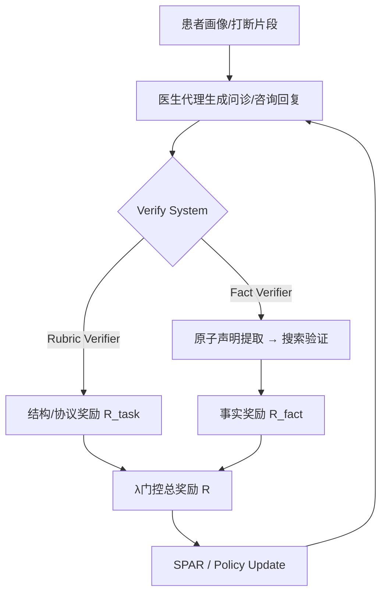

# Baichuan-M3：面向可靠医疗决策的临床问诊建模

## 一句话总结

Baichuan-M3 通过**三段式多教师蒸馏** + **分段流水强化学习（Segmented Pipeline RL）** + **基于原子声明的事实感知强化学习（Fact-Aware RL）**，将医疗大模型从“被动答疑器”改造成能主动问诊、持续推理并自适应抑制幻觉的临床决策助手；在 HealthBench、HealthBench-Hallu 以及新提出的 OSCE 风格动态基准 **ScanBench** 上全面超过 GPT-5.2-High。

---

## 1. 论文解决的问题

### 1.1 问题定义

医疗场景需要的不只是“知识问答正确”，而是**像临床医生一样工作**：
1. **主动信息获取**：患者不会一次性把信息给全，模型需要主动追问关键病史、症状、危险因素。
2. **长程证据整合**：把问诊、鉴别诊断、化验检查、最终诊断四步串联成连贯的临床决策链。
3. **事实可靠性**：医学容错极低，模型必须抑制“流畅的幻觉”，并与外部权威知识对齐。

### 1.2 为什么重要

- **临床容错低**：一个错误的用药建议或漏诊风险后果严重。
- **现有模型偏向被动**：通用大模型（如 GPT-4 系列）知识丰富，但面对开放式问诊时存在 **inquiry inertia**——缺乏主动追问和结构化诊断流程。
- **奖励模型困境**：单一 reward model 很难同时评价“对话结构合规”和“内容事实准确”，容易鼓励“fluency over accuracy”，即越流畅的幻觉越难被惩罚。
- **RL 在医疗长程对话中的信用分配困难**：传统 GRPO 用全局奖励，冗余提问、逻辑断裂、安全遗漏等问题难以被单独修正。

### 1.3 现有方法的不足

论文指出三条主要缺陷：

| 缺陷 | 表现 | 作者的证据/例子 |
| --- | --- | --- |
| **主动患者模拟器不稳定** | 模拟器一旦主动插话，会打乱问诊节奏，导致训练流程不稳定 | 之前的交互式医疗模型通常让模拟器“主动补充信息”，但这会污染医生代理的训练信号（p.4） |
| **单一奖励模型混淆结构质量与事实精度** | 结构奖励和事实奖励耦合，易产生“流畅幻觉” | monolithic reward model 无法解耦 orthogonal dimensions（p.5） |
| **简单幻觉惩罚的工资两类副作用** | 1) 冗余稀释：模型堆砌大量安全但低价值的正确陈述稀释惩罚；2) 惩罚诱导保守：模型输出过短、回避复杂问题 | 式 (9) 的朴素 `R = R_task + α·R_hallu` 在医学上会暴露这两种失败模式（p.15） |

---

## 2. 核心贡献

### 2.1 贡献一：全流程主动临床问诊系统

- **做了什么**：设计了患者模拟器 + 双轨验证系统 + 三段训练管线的完整 RL 训练基础设施。
- **为什么重要**：把医疗 RL 从“单轮监督微调 / 单一 reward model”推进到“长程交互 + 结构/事实双轨验证 + 多阶段蒸馏”。
- **新意**：患者模拟器采用**被动型人格 + 打断注入的非对称可见机制**，既保证医生代理学会主动追问，又不让模拟器自身的行为污染训练。
- **证据**：ScanBench 问诊 74.9，显著超过 GPT-5.2-High（约 62.5）和人类主任医师基线（约 54.9）。

### 2.2 贡献二：SPAR 算法解决长程医疗对话的信用分配

- **做了什么**：提出 **SPAR（Step-Penalized Advantage with Relative baseline）**，用步级惩罚后回报与无惩罚组均值做对比。
- **为什么重要**：长程问诊中局部违规（重复提问、安全遗漏）若靠全局奖励来修正，会导致整个轨迹的信用分配混乱。
- **新意**：将局部惩罚与未受惩罚的全局奖励组基线解耦，形成**隐式课程学习**。
- **证据**：附录 A.1 显示 SPAR 在 Repeat Score（0.90）和 Logical Score（0.69）上同时优于 GRPO 和全局惩罚基线。

### 2.3 贡献三：事实感知 RL 抑制幻觉而不僵化学术能力

- **做了什么**：原子声明提取 → 语义聚类去噪 → 显著性加权 → 外部权威验证 → 动态门控奖励。
- **为什么重要**：简单地对所有幻觉做计数惩罚，会产生“冗余稀释”和“惩罚诱导保守”。
- **新意**：按语义显著性加权，让核心诊断错误受重罚、边缘内容幻觉影响小；同时用基于任务奖励的 Sigmoid 门控，保证模型先学会推理再收紧事实约束。
- **证据**：HealthBench-Hallu 上 refuted rate 从 4.68% 降至 2.45%，uncertain rate 从 3.64% 降至 2.07%；HealthBench Score 只从 66.2 微降到 65.1。

### 2.4 贡献四：ScanBench —— OSCE 风格的多阶段动态评测

- **做了什么**：303 例、12 科室、8,857 条细粒度 checklist、38 类化验动作空间；问诊 → 化验 → 诊断三段流程。
- **为什么重要**：传统 benchmark 测的是“给定完整信息后回答”，ScanBench 测的是“从不完整信息开始主动获取并决策”。
- **证据**：Baichuan-M3 是唯一在所有 SCAN 四维（安全分层、信息澄清、联想提问、规范输出）上都领先的模型。

---

## 3. 模型与数据

> 论文对 Baichuan-M3 的底层模型架构和训练数据的披露极为有限。本节仅汇总论文明确提及或可合理推断的内容，缺失信息在“复现指南”与“附录 A”中进一步整理。

### 3.1 模型架构

**已披露信息**：

| 项目 | 论文披露 |
| --- | --- |
| 模型定位 | 医疗增强型大语言模型，面向临床级决策支持 |
| 系列关系 | Baichuan 医疗模型系列的最新一代（前代 Baichuan-M2） |
| 架构类型 | MoE（Mixture-of-Experts，稀疏激活专家混合） |
| 参数量 | 论文主实验使用 **Baichuan-M3-235B**；激活参数数量未披露 |
| Base model | 论文提及“Baichuan-M3 base model (before RL)”作为消融实验的 backbone（p.36），但未给出层数、hidden size、head/expert 数等细节 |
| 上下文长度 | 论文未披露 |
| Tokenizer | 论文未披露 |

**推断**：
- *推断：基于量化章节对“稀疏激活”和“专家覆盖偏差”的讨论，可判断其采用 MoE 架构。*
- *推断：235B 应为总参数量；若遵循常见 MoE 设计，激活参数可能为几十 B 级别，但论文未明确。*

### 3.2 训练与评测数据

**已披露信息**：

| 数据/数据集 | 说明 |
| --- | --- |
| 患者模拟器输入 | patient profile、inquiry rubrics、behavioral constraints rubrics；打断注入模式再附加预定义对话片段 |
| 专家训练领域 | Clinical Inquiry、Healthcare Consultation、Instruction Following、General Reasoning 四个领域专家 |
| ScanBench（本文提出） | 303 例真实病例、12 个科室、8,857 条 checklist、38 类化验动作空间 |
| HealthBench | 外部医疗问答 benchmark |
| HealthBench-Hallu（本文提出） | 细粒度幻觉评估，原子声明级验证 |
| 权威医学来源 | Fact Verifier 使用搜索增强验证，但未列出具体来源 |

**未披露信息**：

| 类别 | 缺失 |
| --- | --- |
| 预训练/后训练医学语料 | 规模、来源、清洗方式均未披露 |
| 患者模拟器生成的对话量 | 训练用了多少病例、多少轮对话未披露 |
| 离线蒸馏数据集大小 | 各专家 rollout 数量未披露 |
| 标签/标注协议 | ScanBench 的 checklist 由作者构建，但是否公开、inter-annotator agreement 均未说明 |

### 3.3 模型与数据的关系

Baichuan-M3 的改进主要来自**训练管线与奖励设计**，而不是通过注入更大的医学知识库：
- 论文特别指出，Fact-Aware RL 降低幻觉的机制是“规范生成策略”而非“注入新知识”（p.26）。
- 问诊能力的提升主要源于 Segmented Pipeline RL + SPAR 对临床流程的显式建模，并通过 Dynamic Rubric Evolution 对抗 reward hacking。


## 4. 方法详解

### 4.1 三阶段多教师训练管线

**直觉解释**：
先用几个领域专家各自专精（临床问诊 / 医疗咨询 / 通用能力），再把它们“合并”成一个通用学生，最后让这个学生回到真实环境里继续打磨。

**形式化描述**：

| 阶段      | 名称                          | 作用                    | 关键损失/技术                                           |
| ------- | --------------------------- | --------------------- | ------------------------------------------------- |
| Stage 1 | Task RL                     | 从共享初始化训练各领域专家         | 各自任务奖励                                            |
| Stage 2 | Offline Policy Distillation | 专家冻结，学生离线学习           | Clip-Forward-KL                                   |
| Stage 3 | MOPD                        | 学生在线交互，真实奖励 + 多教师先验约束 | Multi-Teacher On-Policy Distillation + reverse KL |

循环迭代：MOPD 产出的统一模型可作为下一轮 Stage 1 的初始化。

**关键公式：Clip-Forward-KL**

Stage 2 的标准 Forward-KL 在单样本离线数据上容易概率过放大。作者定义：

$$

\mathcal{L}_{\text{clip-FKL}}(\theta) = \mathbb{E}_{(s,a)\sim \mathcal{D}} \left[ \mathbb{I}\left( \log \pi_\theta(a|s) < \log \pi_t(a|s) \right) \cdot \left( -\log \pi_\theta(a|s) \right) \right]

$$

**符号解释**：

| 符号 | 含义 |
| --- | --- |
| $\pi_\theta$ | 学生策略 |
| $\pi_t$ | 教师策略 |
| $\mathcal{D}$ | 离线轨迹数据集 |
| $\mathbb{I}(\cdot)$ | 指示函数，仅当学生概率低于教师时才更新 |

**设计权衡**：
- **为什么用 Clip-Forward-KL 不用标准 Forward-KL**：单样本离线场景下标准 KL 会过度放大某个 token 的概率，导致 mode collapse 和低熵。
- **为什么先 Forward-KL 后 reverse-KL**：Stage 2 用 mode-covering 的 Forward-KL 避免冷启动崩溃；Stage 3 用 mode-seeking 的 reverse-KL 在教师冲突建议中挑选最优模式，让学生从“模仿者”变成“决策者”。

---

### 4.2 患者模拟器

**直觉**：训练医生代理需要一个稳定的“病人环境”。如果病人太主动，医生会被动地等待信息；如果病人完全不说话，又测试不了医生处理真实打断的能力。

**设计**：

- **被动型人格模拟器**：不会主动追加病情信息，迫使医生代理主动提问。
- **被动交互模式（75%）**：只给病人画像和量规，无预设对话历史，模拟初诊。
- **打断注入模式（25%）**：给一段预设对话片段，片段以病人提问结束。
- **关键：非对称可见机制**：片段只对**医生代理**可见，对患者模拟器不可见。这样模拟器不会因为看到历史而偏离被动协议，医生代理却要学会处理突如其来的病人提问。
- 打断位置 50% 在回合末尾，50% 在回合中间。

---

### 4.3 Verify System：双轨验证

Verify System 把奖励拆成两个独立流，避免“流畅幻觉”蒙混过关。

#### 4.3.1 Rubric Verifier

- 将一次交互拆成多个可独立判定的规则条目 $r_i$。
- 每个条目有符号权重 $w_i \in [-10, 10]$，LLM judge 输出二元决策 $a_i \in \{0, 1\}$。
- 奖励做 min-max 归一化到 $[0, 1]$：

$$

R_{\text{task}} = \frac{\sum_{i=1}^{N} w_i a_i - \sum_{i:w_i<0} w_i}{\sum_{i=1}^{N} |w_i|}

$$

- 工程优化：异步调度 + prefix-affinity prompt 设计，最大化 KV-cache 复用。

#### 4.3.2 Fact Verifier

三步流水线：
1. **原子声明提取**：长回答拆成自包含、可独立验证的原子声明；做指代消解、干扰项过滤、去重*
2. **搜索增强验证**：对权威医学来源迭代检索，标签为 Supported / Refuted / Uncertain。
3. **两级缓存**：L1 Redis 精确匹配 + L2 向量库语义匹配；缓存命中率从 40% 提升至约 **80%**，外部搜索请求减少约 **85%**。

*注：考试类题目中，原子声明提取会主动排除错误选项复述，避免把题目里的干扰项误判为模型幻觉。*

---

### 4.4 深度临床问诊：Segmented Pipeline RL + SPAR

#### 4.4.1 Segmented Pipeline RL

**直觉**：真实问诊不是一次生成完整回答，而是分阶段推进。每个阶段只做一件事，做错就过滤，不让错误传染到下一阶段。

**四阶段流水线**：
$$

\mathcal{S} = \{\text{Inq}, \text{DDX}, \text{Lab}, \text{Diag}\}

$$

- **Inq**：主动问诊，收集病史、症状、危险因素。
- **DDX**：鉴别诊断，提出候选疾病。
- **Lab**：化验检查，从 38 类动作空间中选择检查项目。
- **Diag**：最终诊断。

**质量门控转移**：

只有当阶段验证分数 $\mathcal{V}_k^{(i)} \ge \tau$ 时，轨迹才进入下一阶段训练池。

$$

x_{k+1}^{(i)} = \left[ x_k^{(i)}, y_k^{(i)}, p_{k+1} \right]

$$

上下文复用：下一阶段的输入直接拼接当前阶段回复 $y_k^{(i)}$ 和下阶段指令 $p_{k+1}$。

#### 4.4.2 SPAR 算法

**直觉**：在长程对话里，全局奖励无法告诉模型“哪一句话”导致重复或逻辑断裂。SPAR 给每个逻辑步骤单独计算惩罚，再用与未受惩罚组比较的相对优势来更新策略。

**关键公式**：

1. **步级有效因子**（只取最严重违规）：

$$

\gamma_j =
\begin{cases}
1, & \text{if } \mathbb{V}_j = \emptyset \\\
\min_{v \in \mathbb{V}_j}(\lambda_v), & \text{otherwise}
\end{cases}

$$

2. **步级优势估计**：

$$

\hat{A}_j = \frac{\gamma_j R_{\text{global}} - \mu_{\text{raw}}}{\sigma_{\text{raw}} + \epsilon}

$$

**符号解释**：

| 符号 | 含义 |
| --- | --- |
| $\mathbb{V}_j$ | 第 $j$ 步触发的违规类型集合 |
| $\lambda_v \in (0,1)$ | 违规 $v$ 的惩罚系数 |
| $R_{\text{global}}$ | 完整轨迹的临床规则奖励 |
| $\mu_{\text{raw}}, \sigma_{\text{raw}}$ | 同 prompt 下多 rollout 的全局奖励均值与标准差（**不含步惩罚**） |
| $\epsilon$ | 防止除零的小常数 |

**隐式课程机制**：

- **早期**：$\sigma_{\text{raw}}$ 大，严重违规（如重复提问，$\lambda \approx 0.1$）会产生巨大负优势，模型优先修正关键错误。
- **后期**：$\sigma_{\text{raw}}$ 减小，轻微违规（如措辞僵硬，$\lambda \approx 0.9$）的细粒度信号开始主导，实现风格精进。

---

### 4.5 可信健康咨询：Dynamic Rubric Evolution

#### 4.5.1 动机

静态规则在 RL 中容易被 reward hack：模型可能学会“被动 verbosity”“防御性模板”“幻觉细节”来凑分。

#### 4.5.2 Mine-Verify-Inject 闭环

1. **Mining**：识别高置信缺陷样本（高奖励但潜藏问题）。
2. **Verify（AI 起草 + 人工审核）**：AI 根据对抗性模式起草候选约束；人类专家检查边界确定性及与元原则的符合性（如 Safety > Empiricism）。
3. **Inject**：把通过审核的规则注入动态规则集。

#### 4.5.3 生命周期

- **准入**：仅当某缺陷模式违规率统计显著时才加入。
- **退出**：连续多轮违规率趋近 0 时自动退役，防止奖励稀释。

- **核心规则集**：只基于问题合成，保证安全基本面。
- **动态规则集**：基于问题 + 模型历史回复合成，针对训练中新发现的漏洞。

---

### 4.6 事实感知强化学习（Fact-Aware RL）

#### 4.6.1 问题

式 (9) 的朴素 RLVR：

$$

R = R_{\text{task}} + \alpha \cdot R_{\text{hallu}}

$$

其中 $R_{\text{hallu}}$ 是计数型幻觉率。这会导致：
1. **冗余稀释（Redundancy-Induced Dilution）**：模型堆砌大量正确但低价值的陈述，把幻觉率“稀释”下去。
2. **惩罚诱导保守（Penalty-Induced Conservatism）**：输出越来越短，回避复杂问题，损害咨询有用性。

#### 4.6.2 结构化信号去噪

1. 将声明 $\{c_i\}$ 和句子 $\{s_j\}$ 经语义编码器 $\mathcal{E}(\cdot)$ 映射到向量空间。
2. 语义聚类（cosine 阈值），避免同义改写被重复惩罚。
3. 取每簇代表声明 $c_k^*$。

**显著性权重**：代表声明与全文中所有句子的最大语义相关度。

$$

w(c_k^*) = \max_{1 \le j \le M} \cos(\mathcal{E}_{c_k^*}, \mathcal{E}_{s_j})

$$

**事实奖励**（负向惩罚）：

$$

R_{\text{fact}} = -\frac{\sum_{k=1}^{K} w(c_k^*) \cdot \mathbb{I}(c_k^*)}{\sum_{k=1}^{K} w(c_k^*) + \epsilon}

$$

其中 $\mathbb{I}(c_k^*) = 1$ 当且仅当 $c_k^*$ 为 Refuted 或 Uncertain。

**效果**：
- 分母按显著性加权，中性化“堆砌低价值正确陈述”的稀释策略。
- 分子按显著性放大大核心诊断错误的惩罚。

#### 4.6.3 动态多目标聚合

软软的 Sigmoid 门控系数 $\lambda(R_{\text{task}})$：

$$

\lambda(R_{\text{task}}) = \sigma\left( \kappa \cdot \frac{R_{\text{task}} - \mu}{\Delta} \right)

$$

参数：$\tau_{\min}=0.75$，$\tau_{\max}=0.95$，$\kappa=10$，$\mu = (\tau_{\min}+\tau_{\max})/2$，$\Delta = \tau_{\max} - \tau_{\min}$。

总奖励：

$$

R = R_{\text{task}} + \lambda(R_{\text{task}}) \cdot R_{\text{fact}}

$$

三个阶段：

| Zone | $R_{\text{task}}$ 范围 | $\lambda$ | 策略含义 |
| --- | --- | --- | --- |
| 保护 Zone | $< 0.75$ | $\to 0$ | 先学会基本推理，不因为事实惩罚而变保守 |
| 过渡 Zone | $[0.75, 0.95]$ | 非线性增大 | 逐步引入事实约束 |
| 约束 Zone | $> 0.95$ | $\to 1$ | 全面压制幻觉 |

---

## 5. 架构 / 流程图

### 5.1 三阶段训练管线（第 7-8 页）


> **Figure 1（对应 PDF 第 7-8 页）**：Baichuan-M3 的三阶段训练基础设施。Stage 1 培养领域专家；Stage 2 用 Clip-Forward-KL 做离线策略蒸馏；Stage 3 通过 MOPD 让学生在线交互并统一多教师先验。

### 5.2 分段流水线 RL 与 SPAR（第 10-11 页）


> **Figure 2（对应 PDF 第 10-11 页）**：左侧为异步多任务分段流水线（Inq → DDX → Lab → Diag），轨迹经过 Trajectory Verifier 和 Global Verifier；右侧为 SPAR 策略学习流程，将步级惩罚与全局奖励结合，计算相对于未受惩罚组基线的优势。

### 5.3 Fact-Aware RL 全流程（第 16 页）


> **Figure 3（对应 PDF 第 16 页）**：Fact-Aware RL 流程。医学查询 → 生成回复 → 原子声明提取、去噪与加权 → 语义聚类与重要性评估 → 在线事实验证（LLM / WebSearch / WebFetch）→ 验证结果 → 任务奖励 + 门控事实奖励 → 策略更新。验证系统包含 Redis 精确缓存与向量语义缓存。

### 5.4 流程 Mermaid



---

## 6. 实验结果

### 6.1 实验设置

| 项目 | 内容 |
| --- | --- |
| 数据集 | ScanBench（303 例，12 科室，8,857 checklist 项，38 类化验动作）；HealthBench；HealthBench-Hallu |
| 评估者 | GPT-4.1（ScanBench 问诊阶段 OSCE 关键点验证）、Rubric Verifier、Fact Verifier（权威医学来源 + 搜索） |
| Baseline | GPT-5.2-High、Qwen3-235B、AntAngelMed、Baichuan-M2-32B、人类主任医师基线 |
| 主要模型 | Baichuan-M3-235B |
| 硬件（附录 A.4） | NVIDIA H20 GPUs |
| 训练框架 | SpecForge（推测解码训练）、SGLang（推理框架） |

### 6.2 ScanBench 主结果

Baichuan-M3 在所有三个工作站全面第一：

| Station | Baichuan-M3 | GPT-5.2-High | 人类基线 |
| --- | --- | --- | --- |
| Clinical Inquiry | **74.9** | ~62.5 | ~54.9 |
| Laboratory Testing | **72.1** | — | — |
| Final Diagnosis | **74.4** | — | — |

SCAN 四维分解：

| Dimension | Baichuan-M3 | GPT-5.2-High | Qwen3-235B | Human |
| --- | --- | --- | --- | --- |
| Safety Stratification | **75.8** | — | 48.3 | 40.1 |
| Information Clarification | **84.5** | 81.4 | — | — |
| Associative Questioning | **72.6** | 54.5 | — | — |
| Normative Output | **59.9** | 43.2 | — | — |

**关键结论**：在所有 SCAN 子维度上均领先，尤其是 **Safety Stratification 75.8**，几乎 doubles 人类基线 40.1。

### 6.3 动态咨询效率（图 6，第 21-22 页）

- 随着对话轮数增加，基础信息（Clarity Matters）各模型趋于收敛。
- **Associative Questioning** 和 **Safety Stratification** 上，Baichuan-M3 持续拉开差距，而 GPT-5.2-High 在长程对话中停滞于约 0.5。
- 说明专门训练的模型在信息收敛后，仍能进行更深层的联想式追问和风险分层。

### 6.4 HealthBench 主结果


> **Figure 7（对应 PDF 第 23 页）**：HealthBench 总体对比，Baichuan-M3 Total 65.1、Hard 44.4、Hallucination Rate 3.5%，均处于领先位置。

| 模型 | HealthBench Total | HealthBench Hard | Hallucination Rate |
| --- | --- | --- | --- |
| Baichuan-M3 | **65.1** | **44.4** | **3.5%** |
| GPT-5.2-High | 63.3 | 42.0 | — |
| AntAngelMed | — | 39.6 | — |

细粒度对比（图 8, p.23-24）显示 M3 在 **context seeking** 和 **context awareness** 上的提升，主要归功于 Deep Clinical Consultation 训练的迁移。

### 6.5 HealthBench-Hallu

HealthBench-Hallu 提出加权幻觉率：

$$

H = \frac{\sum_{i=1}^{N} w_i}{|\text{Total Claims}|}

$$

权重：Refuted=1.0，Uncertain=0.5，Supported=0.0。

结果：

| 模型 | HealthBench Score | Refuted Rate | Uncertain Rate |
| --- | --- | --- | --- |
| M3 w/o Fact-Aware RL | 66.2 | 4.68% | 3.64% |
| **Baichuan-M3-235B** | **65.1** | **2.45%** | **2.07%** |
| GPT-5.2-High | — | 2.37% | 2.78% |

Fact-Aware RL 将两类错误率大致减半，性能仅下降 1.1 分。

### 6.6 知识探针：幻觉来自“不忠实”还是“无知”？

图 9（p.26）区分两类幻觉来源：
- **Contradictory** / **Inconsistent**：模型内部认知与输出不一致，属于“不忠实幻觉”（unfaithful hallucination）。
- **Consistent**：模型内部认知确实错误，属于“诚实的知识错误”。

在 Refuted Claims 上，Baichuan-M3 的 **Consistent 率 44.9%**，高于 M3 w/o Fact-Aware RL（39.7%）。

**解读**：Fact-Aware RL 主要减少的是“模型明知答案不对还瞎编”的情况，而不是简单注入新知识。它更像是在**规范生成策略**，让模型的外部输出收敛到其真实知识边界内。

### 6.7 消融实验（附录 A.1–A.4）

#### A.1 SPAR 消融（p.36-37）

| 方法 | Repeat Score | Logical Score | Rubrics Score |
| --- | --- | --- | --- |
| GRPO | 0.65 | 0.28 | — |
| Global Penalty | 0.47 | 0.51 | — |
| **SPAR** | **0.90** | **0.69** | — |

SPAR 同时降低重复并保持逻辑连贯，优于全局奖励/惩罚基线。

#### A.2 Claim Extractor 选择（p.37）

| 模型 | Recall | GPT Exclusivity | SFT Exclusivity | 备注 |
| --- | --- | --- | --- | --- |
| Qwen3-8B | 30.45% | — | — | 基线 |
| SFT-8B | 72.80% | 27.20% | 45.60% | 在线使用 |
| SFT-32B | 73.00% | — | — | 性能接近但成本更高 |

最终选择 **SFT-8B** 作为在线提取器。

#### A.3 Clip-Forward-KL 消融（p.39）

| 蒸馏损失 | ScanBench | HealthBench | HealthBench-Hard |
| --- | --- | --- | --- |
| Forward-KL | 73.7 | 58.6 | 33.2 |
| **Clip-Forward-KL** | **73.5** | **61.1** | **38.5** |

Clip-Forward-KL 在保持 ScanBench 的同时，显著改善 HealthBench 与 Hard subset。

#### A.4 Gated Eagle-3 消融（p.40）

| 指标 | 提升 |
| --- | --- |
| 平均接受长度 | +0.31 |
| GSM8K 吞吐 | +14.40% |
| HumanEval 吞吐 | +12.15% |
| MT-Bench 吞吐 | +8.58% |
| HealthBench 吞吐 | +12.21% |

---

## 7. 工程视角分析

### 7.1 实现难度

| 模块 | 难度 | 原因 |
| --- | --- | --- |
| 患者模拟器 | 中 | 需要稳定的任务描述和被动人格，非对称可见机制实现简单但设计精巧 |
| Verify System | 高 | Rubric Verifier 需要大量医学专家和 prompt 工程；Fact Verifier 需要搜索引擎、缓存、8B 提取器在线部署 |
| SPAR | 中 | 在现有 RL 框架上增加步级优势和组基线，工程改动可控，但调参敏感 |
| Fact-Aware RL | 高 | 需要训练 SFT-8B claim extractor、语义聚类、外部搜索、缓存系统、门控奖励，链路长 |
| 多教师蒸馏 | 高 | 需要维护多个教师模型、离线数据集、在线交互环境，训练管线复杂 |

### 7.2 性能瓶颈

- **Fact Verifier 延迟**：外部搜索是最大瓶颈。两级缓存将搜索请求减少 85%，是 RL 在线训练可行的关键。
- **SPAR 组基线计算**：同 prompt 多 rollout，需要更大的 rollout 吞吐和内存。
- **分段流水线调度**：不同阶段任务并行，需要精细的 batch 调度，避免某些阶段 GPU 空闲。
- **MoE 量化校准**：传统校准只激活部分专家，导致 INT4 精度不稳定，需自生成多领域 prompt 覆盖全部专家。

### 7.3 资源消耗

- 多个专家教师模型并行训练/蒸馏，需要大量 GPU 显存。
- Fact Verifier 的 8B 提取器 + 搜索 + 缓存系统需要额外 serving 资源。
- Gated Eagle-3 的 draft model 需要单独训练，但推理吞吐提升可抵消训练成本。

### 7.4 工程权衡

- **主动追问 vs. 用户耐心**：模型问诊得分高，但实际部署中过度追问可能导致用户体验下降，需要产品层控制。
- **缓存 vs. 实时性**：80% 缓存命中率意味着 20% 仍要实时搜索，高时效医学知识更新需设计 cache invalidation。
- **精度 vs. 速度**：HealthBench-Hallu 高配置用 GPT-5 提取器和实时多轮搜索，训练期用 SFT-8B + 缓存，这是精度与成本的合理折中。

### 7.5 生产落地风险

- **罕见高风险错误仍存在**：作者明确局限。
- **权威来源依赖**：Fact Verifier 的有效性取决于搜索源质量，对中文医疗生态的可用性需要验证。
- **跨科室泛化**：ScanBench 覆盖 12 科室，但真实临床长尾更多。
- **法律与合规**：医疗建议必须经医生审核，模型输出不能直接用于诊断。

---

## 8. LLM / Infra 专项分析

### 8.1 对训练的影响

- **长上下文需求**：临床问诊多轮对话需要较大的 context window，分段流水线会进一步累积上下文。
- **RL 训练稳定性**：双轨奖励 + SPAR + 门控奖励显著提高了奖励信号的信噪比，但系统复杂度也上升。
- **MoE 稀疏激活**：需确保不同专家在专科任务上被充分激活，自生成校准是 MoE 量化落地的关键经验。
- **Scaling**：Cycle Iteration 机制让模型可以持续提升，边际成本低于从头训练。

### 8.2 对推理的影响

- **Prefill/Decode 都长**：医疗咨询回复通常较长，且用户期望低延迟。
- **Gated Eagle-3**：通过门控 attention 调节 draft model 对 target model hidden states 的接受程度，平均接受长度 +0.31，吞吐 +12%。
- **INT4 量化**：对 MoE 做 weight-only INT4，性能接近 BF16，显著降低部署成本。

### 8.3 对 CUDA / Kernel 的影响

- 论文未披露具体 CUDA kernel 实现。
- 推测：Gated Attention 可能涉及自定义 element-wise gating kernel；分段流水线需要高效的 KV-cache 复用和异步调度。
- MoE INT4 量化需要支持 GPTQ/AutoRound 的推理框架（论文用 SGLang）。

### 8.4 Trace / Profiling 关注点

如果复现或部署，建议重点看：

| 工具 | 关注点 |
| --- | --- |
| Nsight Systems | Fact Verifier 的搜索/缓存延迟、异步流水线调度、GPU idle time |
| Nsight Compute | Gated Attention 的 memory access pattern、MoE 量化后 expert routing 的显存带宽 |
| PyTorch Profiler | SPAR 的多 rollout 组基线计算、分段流水线的 backward 开销 |
| 自定义 metrics | 缓存命中率、Rubric Verifier KV-cache 复用率、接受长度分布 |

---

## 9. 局限性与问题

### 9.1 作者明确提到的局限

- 当前仅支持**文本、单 episode 场景**。
- 未覆盖 **longitudinal 疾病管理**、**多模态临床信号**、**超长程患者轨迹推理**。
- 罕见高风险错误仍然存在。
- 明确的循证医学 grounding 仍是开放挑战。

### 9.2 深层局限分析

- **权威来源依赖**：Fact Verifier 没有披露具体搜索源列表和更新机制，真实落地需要医学知识库的持续维护。
- **ScanBench 人类基线的代表性**：来自三甲医院、5 年以上经验的主治医师，但不等于所有临床场景。
- **奖励函数的元原则由人类专家定义**：元原则（如 Safety > Empiricism）本身隐含价值判断，不同医疗系统可能不同。
- **幻觉评估是相对的**：HealthBench-Hallu 将 Uncertain 也计入惩罚，但医学中“不确定”有时是必要的临床诚实表达；过度惩罚可能让模型变得过度自信。
- **GPT-4.1 / GPT-5 作为 judge**：存在模型评估者的能力上限和偏见。

### 9.3 未来改进方向

- 多模态：融合影像、化验单、时序生理信号。
- Longitudinal：追踪慢性病患者长期轨迹。
- 更强的循证 grounding：每一步建议都标注来源和置信度。
- 在线学习与安全护栏结合：部署后持续学习罕见病例，同时防止灾难性遗忘。

---

## 10. 复现指南

### 10.1 复现所需资源

| 项目 | 内容 |
| --- | --- |
| Code | https://huggingface.co/collections/baichuan-inc/baichuan-m3 |
| Dataset | ScanBench（论文自行构建，未明确是否开源）；HealthBench、HealthBench-Hallu（公开） |
| Hardware | 训练未披露；推理消融用 NVIDIA H20 |
| Checkpoint | Baichuan-M3-235B HF 集合 |
| Training config | *论文未披露完整超参数、优化器、学习率、batch size、训练步数* |
| Evaluation script | HealthBench 官方；ScanBench 未明确开源 |

### 10.2 论文缺失信息

| 类别 | 缺失信息 | 影响 |
| --- | --- | --- |
| 模型架构 | 未披露 Baichuan-M3 的 base model 版本、层数、MoE 配置、参数量（235B 是作者提到的一个变体） | 难以精确复现模型规模 |
| 训练超参 | 学习率、batch size、优化器、训练 token 数、RL rollout 数、PPO/GRPO/GSPO 的具体实现细节 | 训练复现困难 |
| 数据规模 | 患者模拟器生成的训练对话数量、各阶段专家训练数据量、离线蒸馏数据集大小 | 无法评估训练成本 |
| 验证源 | Fact Verifier 使用的“权威医学来源”具体是什么（UpToDate？医学教科书？中文指南？） | 影响事实性评估和落地 |
| ScanBench | 是否开源、标注协议、inter-annotator agreement | 无法独立验证该 benchmark |
| Gated Eagle-3 | gating vector 维度、生成方式、训练目标细节、draft model 规模 | 难以精确复现推理加速方案 |
| 量化校准 | 多领域 prompt 集大小和领域分布、AutoRound/GPTQ 具体配置 | 只能按论文描述近似复现 |

### 10.3 复现难度评分

**评分：4/5**

原因：
- 模型权重已开源，基础推理可快速跑通。
- 但训练管线涉及患者模拟器、双轨验证系统、多教师蒸馏、SPAR、Fact-Aware RL，链路极长且大量实现细节未披露。
- ScanBench 和数据构造流程未明确开源，完整复现几乎不可能。

---

## 11. 与已有工作的关系

### 11.1 技术演进链

```text
通用医疗 LLM (Med-PaLM, Baichuan-M1/M2)
  ↓ 问题：被动问答，缺乏主动问诊
医疗对话模型 + 主动问诊
  ↓ 问题：单轨奖励、容易 reward hack
双轨验证 + Rubric/Fact Verifier
  ↓ 问题：长程对话信用分配差
SPAR + 分段流水线 RL
  ↓ 问题：幻觉抑制损害能力
Fact-Aware RL + Dynamic Rubric Evolution
  ↓
Baichuan-M3
```

### 11.2 相关工作对比

| 工作 | 核心思想 | 与本文关系 |
| --- | --- | --- |
| Med-PaLM / Med-PaLM 2 | 医学 SFT + 检索增强 | 更早的医疗 LLM，偏向被动问答 |
| AntAngelMed | 医疗长文本与推理 | HealthBench-Hard 基线，本文超过 |
| GPT-5.2 / GPT-5 | 通用大模型 | 本文在医疗问诊、安全分层、幻觉率上超过 |
| Eagle-3 | 推测解码 | 本文在其基础上加 Gated Attention，提升接受长度与吞吐 |
| RLVR / Constitutional AI | 规则/原则驱动的 RL | 本文将其应用在医疗，并细化为 rubric + atomic claim 双轨 |

### 11.3 可链接的已有笔记

* [[Eagle-3--Speculative-Decoding]]
* [[AutoRound--GPTQ-Quantization]]
* [[HealthBench--Medical-LLM-Benchmark]]
* [[RLHF-DPO-GRPO--RL-for-LLM]]
* [[MoE--Mixture-of-Experts-Inference]]

---

## 12. 知识图谱

```text
医疗大模型
├── 主动问诊
│   ├── 患者模拟器（被动型人格 + 非对称打断）
│   └── 分段流水线 RL（Inq → DDX → Lab → Diag）
├── 奖励工程
│   ├── Rubric Verifier（结构/协议奖励）
│   ├── Fact Verifier（原子声明 + 搜索验证）
│   ├── SPAR（步级优势 + 相对基线）
│   └── Dynamic Rubric Evolution（Mine-Verify-Inject）
├── 幻觉抑制
│   ├── 原子声明提取
│   ├── 语义聚类去噪
│   ├── 显著性加权事实奖励
│   └── 任务奖励门控
├── 评测
│   ├── ScanBench（OSCE 动态模拟）
│   ├── HealthBench
│   └── HealthBench-Hallu
└── 推理优化
    ├── Gated Eagle-3 推测解码
    └── MoE INT4 自生成校准量化
```

---

## 13. 个人思考

### 13.1 最核心的洞察

Baichuan-M3 把“医疗 AI 的可靠性”拆成了两个正交维度：**结构正确的问诊流程** 和 **事实正确的医学内容**。通过双轨 Verify System 分别打分，再用门控机制把事实约束“课程化”地引入训练，避免了“为了 suppression 幻觉而牺牲能力”的常见病。这个解耦思路对任何高风险领域的 RLHF 都有借鉴意义。

### 13.2 最值得记住的数字

- **ScanBench Clinical Inquiry 74.9**：远超 GPT-5.2-High（62.5）和人类（54.9）。
- **Safety Stratification 75.8**：几乎是人类的两倍（40.1）。
- **HealthBench-Hallu refuted rate 2.45%**：w/o Fact-Aware RL 时是 4.68%，几乎减半。
- **Verify System 缓存把外部搜索减少 85%**：这是在线 RL 训练可行的关键工程点。

### 13.3 最值得学习的设计选择

1. **非对称可见的打断注入**：让模拟器稳定被动，医生代理却要处理真实中断。
2. **Clip-Forward-KL**：单样本离线蒸馏的概率下界约束，比标准 KL 更适合 RL 蒸馏。
3. **SPAR 的隐式课程**：不需要手动调整课程，用 $\sigma_{\text{raw}}$ 自然衰减实现从“纠大错”到“精细节”的过渡。
4. **事实奖励的动态门控**：先学推理再收紧安全，防止过早惩罚导致保守。

### 13.4 我会如何复现 / 验证

- 先用开源权重在 HealthBench 上验证主指标是否对齐。
- 如果论文后续开源患者模拟器，尝试在自己的科室数据上跑分段流水线，看 SPAR 是否能降低重复提问。
- 对 Fact-Aware RL 做一个简化版：用 Llama-3-8B 做 claim extractor，接入 PubMed / 医学百科搜索，看是否能在中文医疗 QA 上降低幻觉率。

### 13.5 我会继续追的问题

- ScanBench 是否会开源？它的 checklist 构建和 inter-annotator agreement 是什么？
- MOPD 中 reverse KL 的系数和收敛性细节？
- Gated Eagle-3 的 gating vector 在不同层是否有不同模式？
- 事实验证系统在中英文医学来源不一致时如何表现？

---

## 14. 面试问题

### Junior

1. Baichuan-M3 的两个 reward verifier 分别负责什么？
2. SPAR 中的 “relative baseline” 是什么意思？为什么要和未受惩罚的组均值比较？
3. 为什么患者模拟器要用“被动型人格”而不是主动型人格？
4. 事实奖励中的 saliency weight 解决什么问题？

### Senior

1. 解释 Clip-Forward-KL 与标准 Forward-KL 的区别，以及为什么 Stage 2 用前者、Stage 3 用 reverse KL。
2. 如果 SPAR 的步级惩罚设计不当，会出现什么训练动力学问题？
3. 两级缓存系统为什么能把外部搜索请求减少 85%？在什么情况下缓存会失效？
4. Dynamic Rubric Evolution 如何避免 reward hacking 和新规则导致的 reward dilution？

### Staff / Principal

1. 如果你是另一个医疗 AI 团队的技术负责人，Baichuan-M3 的哪些设计可以直接复用，哪些需要针对你的场景重新设计？
2. 在生产环境中，你如何保证 Fact Verifier 的搜索源持续更新、且不误伤“医学不确定性”的合理表达？
3. 从系统架构角度，Baichuan-M3 的训练管线存在哪些单点瓶颈？如果要 scale 到 10 倍更大的模型和更长的患者轨迹，你最担心什么？
4. 该论文声称在 HealthBench-Hallu 上“consistency on refuted claims 越高越好”，这个观点是否在所有医疗场景下都成立？是否存在过拟合到内部知识的反例？

---

## 15. 关键引用

```bibtex
@article{baichuan2025m3,
  title={Baichuan-M3: Modeling Clinical Inquiry for Reliable Medical Decision-Making},
  author={Baichuan-M3 Team},
  journal={arXiv preprint arXiv:2602.06570},
  year={2025},
  url={https://arxiv.org/abs/2602.06570v1}
}
```

---

## 附录 A：论文未披露的关键信息

| 参数类别 | 缺失信息 | 说明 |
| --- | --- | --- |
| 模型架构 | 完整 base model 配置、MoE 专家数/路由方式、235B 是否总参或激活参 | 仅知存在 235B 变体 |
| 训练规模 | 各阶段训练 token/步数、患者模拟器生成的对话轮数、专家模型数量 | 无法评估总训练成本 |
| 训练超参 | 学习率、batch size、RL rollout 数、PPO/GRPO/GSPO 配置、优势函数参数 | 影响精确复现 |
| 验证源 | Fact Verifier 的“权威医学来源”具体列表和更新机制 | 决定事实性上限 |
| ScanBench | 是否开源、标注协议、inter-annotator agreement | 无法独立验证 |
| Gated Eagle-3 | gate vector 维度/生成方式、训练目标、draft model 规模 | 难以精确复现 |
| 量化校准 | 多领域 prompt 集大小/领域分布、AutoRound 配置 | 只能近似复现 |
| 推理部署 | 实际服务 QPS、延迟、成本数据 | 未披露 |

---

## 附录 B：分块阅读覆盖记录

| Chunk | Page Range | Subagent Output | Covered |
| --- | --- | --- | --- |
| chunk_001 | 1-8 | agent_outputs/chunk_001.md | yes |
| chunk_002 | 9-16 | agent_outputs/chunk_002.md | yes |
| chunk_003 | 17-24 | agent_outputs/chunk_003.md | yes |
| chunk_004 | 25-32 | agent_outputs/chunk_004.md | yes |
| chunk_005 | 33-40 | agent_outputs/chunk_005.md | yes |